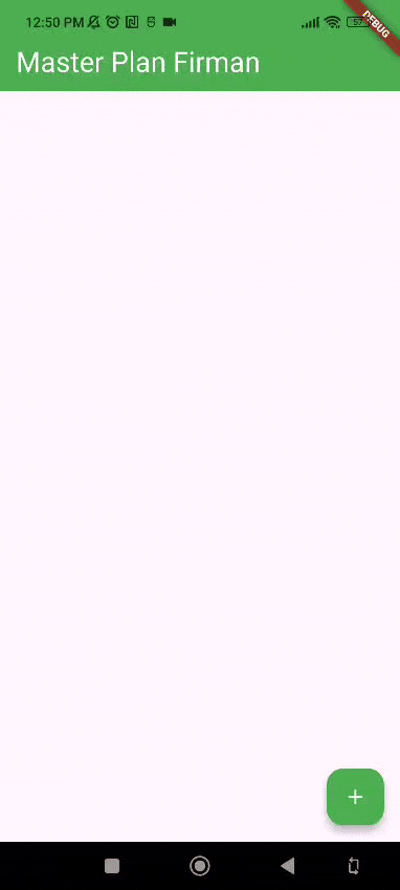

# Laporan Praktikum

# 10 | Dasar State Management

# Pemrograman Mobile

### Nama : Mochammad Firmandika Jati Kusuma

### NIM : 2341720229

## Tugas Praktikum 1: Dasar State dengan Model-View

1. Selesaikan langkah-langkah praktikum tersebut, lalu dokumentasikan berupa GIF hasil akhir praktikum beserta penjelasannya di file README.md! Jika Anda menemukan ada yang error atau tidak berjalan dengan baik, silakan diperbaiki.

    Jawab :

    

2. Jelaskan maksud dari langkah 4 pada praktikum tersebut! Mengapa dilakukan demikian?

    Jawab : Langkah 4 membuat file data_layer.dart yang berfungsi sebagai barrel export untuk menggabungkan semua model dalam satu file. Tujuannya adalah untuk mempermudah proses import di file lain. Daripada harus mengimpor setiap model secara terpisah (import 'task.dart' dan import 'plan.dart'), kita cukup mengimpor satu file saja (import 'data_layer.dart'). Ini membuat kode lebih bersih, mudah dikelola, dan mengurangi jumlah baris import ketika aplikasi berkembang dengan banyak model.

3. Mengapa perlu variabel plan di langkah 6 pada praktikum tersebut? Mengapa dibuat konstanta ?

    Jawab : Variabel plan diperlukan untuk menyimpan state atau data aplikasi yang berisi daftar tugas-tugas pengguna. Variabel ini dibuat sebagai konstanta (const Plan()) karena pada awal aplikasi, kita memulai dengan plan kosong yang tidak berubah sampai pengguna melakukan aksi tertentu. Penggunaan const juga mengoptimalkan performa karena Flutter tidak perlu membuat objek baru di memori setiap kali widget di-rebuild, melainkan menggunakan objek yang sama.

4. Lakukan capture hasil dari Langkah 9 berupa GIF, kemudian jelaskan apa yang telah Anda buat!

    Jawab : 
    
    
    
    Aplikasi Master Plan yang telah dibuat adalah aplikasi to-do list sederhana dengan fitur-fitur berikut: pengguna dapat menambah tugas baru dengan menekan tombol floating action button (+), setiap tugas memiliki checkbox untuk menandai sebagai selesai atau belum, pengguna dapat mengedit deskripsi tugas langsung di dalam text field, dan aplikasi menggunakan ListView yang dapat di-scroll untuk menampilkan daftar tugas. State management dilakukan menggunakan setState() sehingga perubahan data langsung terlihat di UI.

5. Apa kegunaan method pada Langkah 11 dan 13 dalam lifecyle state ?

    Jawab : Method initState() pada Langkah 11 berfungsi untuk inisialisasi yang dilakukan sekali saat widget pertama kali dibuat. Di sini ScrollController diinisialisasi dan ditambahkan listener untuk menghilangkan fokus keyboard saat pengguna melakukan scroll, terutama berguna di iOS. Sedangkan method dispose() pada Langkah 13 berfungsi untuk membersihkan resource yang tidak lagi digunakan saat widget dihancurkan. ScrollController harus di-dispose untuk mencegah memory leak karena listener yang tidak dibersihkan dapat menyebabkan objek tetap berada di memori meskipun widget sudah tidak digunakan.

6. Kumpulkan laporan praktikum Anda berupa link commit atau repository GitHub ke dosen yang telah disepakati !
   
   Jawab :
