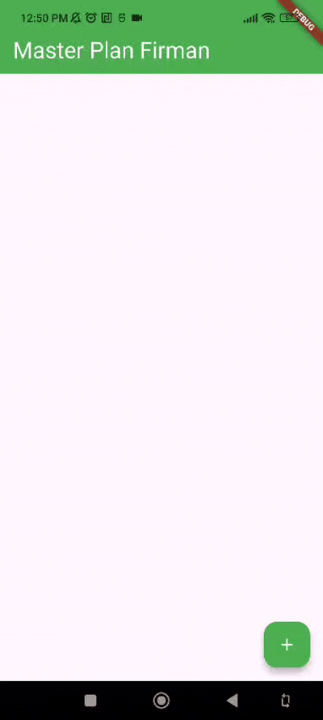
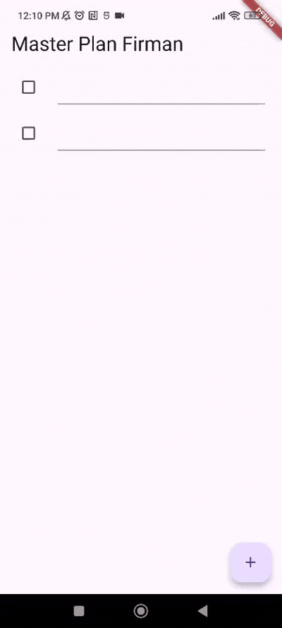
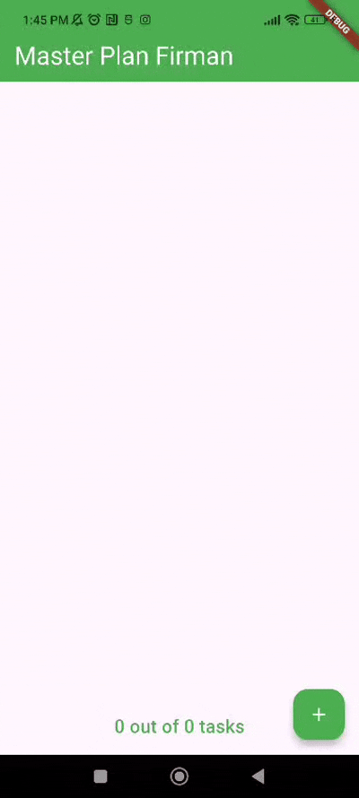
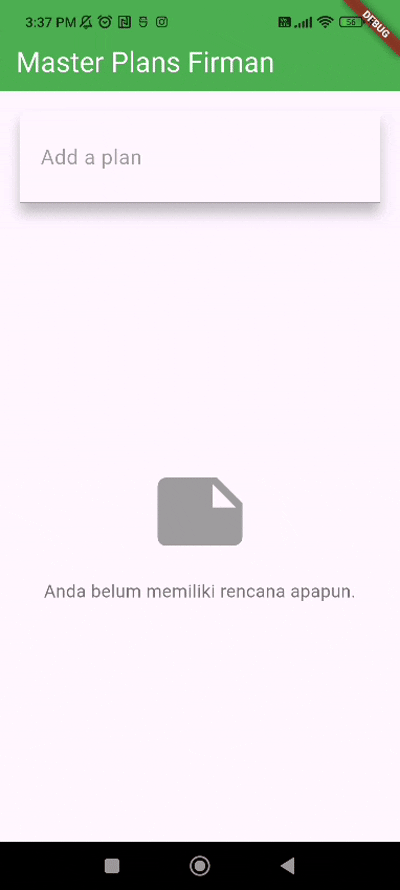

# Master Plan - Aplikasi To-Do List dengan State Management

# Pemrograman Mobile

### Nama : Mochammad Firmandika Jati Kusuma

### NIM : 2341720229

## Tugas Praktikum 1: Dasar State dengan Model-View

1. Selesaikan langkah-langkah praktikum tersebut, lalu dokumentasikan berupa GIF hasil akhir praktikum beserta penjelasannya di file README.md! Jika Anda menemukan ada yang error atau tidak berjalan dengan baik, silakan diperbaiki.

    Jawab :

    

    Praktikum ini membuat aplikasi Master Plan, yaitu aplikasi daftar tugas (to-do list) sederhana menggunakan Flutter. Tujuan utamanya adalah belajar cara mengelola data dalam aplikasi (state management) dengan dua pendekatan berbeda.Aplikasi Master Plan memiliki fitur dasar seperti menambah tugas baru dengan menekan tombol plus, mengedit nama tugas langsung di layar, mencentang tugas yang sudah selesai, dan melihat berapa banyak tugas yang sudah diselesaikan. Semua elemen menggunakan warna hijau yang konsisten untuk memberikan tampilan yang menarik.

    Praktikum ini dibagi menjadi dua tahap pembelajaran. Tahap pertama menggunakan cara sederhana dengan setState() dimana semua data disimpan di dalam satu layar dan setiap perubahan data akan memperbarui tampilan. Cara ini mudah dipahami tapi tidak cocok untuk aplikasi yang besar karena sulit dikelola.Tahap kedua menggunakan pendekatan yang lebih baik dengan Provider dan ValueNotifier. Dalam pendekatan ini, data dipindahkan ke tempat terpisah sehingga bisa digunakan oleh berbagai bagian aplikasi. Tampilan akan otomatis berubah ketika data berubah tanpa perlu memanggil setState() secara manual. Ini membuat kode lebih rapi dan mudah dikembangkan.

2. Jelaskan maksud dari langkah 4 pada praktikum tersebut! Mengapa dilakukan demikian?

    Jawab : Langkah 4 membuat file data_layer.dart yang berfungsi sebagai barrel export untuk menggabungkan semua model dalam satu file. Tujuannya adalah untuk mempermudah proses import di file lain. Daripada harus mengimpor setiap model secara terpisah (import 'task.dart' dan import 'plan.dart'), kita cukup mengimpor satu file saja (import 'data_layer.dart'). Ini membuat kode lebih bersih, mudah dikelola, dan mengurangi jumlah baris import ketika aplikasi berkembang dengan banyak model.

3. Mengapa perlu variabel plan di langkah 6 pada praktikum tersebut? Mengapa dibuat konstanta ?

    Jawab : Variabel plan diperlukan untuk menyimpan state atau data aplikasi yang berisi daftar tugas-tugas pengguna. Variabel ini dibuat sebagai konstanta (const Plan()) karena pada awal aplikasi, kita memulai dengan plan kosong yang tidak berubah sampai pengguna melakukan aksi tertentu. Penggunaan const juga mengoptimalkan performa karena Flutter tidak perlu membuat objek baru di memori setiap kali widget di-rebuild, melainkan menggunakan objek yang sama.

4. Lakukan capture hasil dari Langkah 9 berupa GIF, kemudian jelaskan apa yang telah Anda buat!

    Jawab : 
    
    
    
    Aplikasi Master Plan yang telah dibuat adalah aplikasi to-do list sederhana dengan fitur-fitur berikut: pengguna dapat menambah tugas baru dengan menekan tombol floating action button (+), setiap tugas memiliki checkbox untuk menandai sebagai selesai atau belum, pengguna dapat mengedit deskripsi tugas langsung di dalam text field, dan aplikasi menggunakan ListView yang dapat di-scroll untuk menampilkan daftar tugas. State management dilakukan menggunakan setState() sehingga perubahan data langsung terlihat di UI.

5. Apa kegunaan method pada Langkah 11 dan 13 dalam lifecyle state ?

    Jawab : Method initState() pada Langkah 11 berfungsi untuk inisialisasi yang dilakukan sekali saat widget pertama kali dibuat. Di sini ScrollController diinisialisasi dan ditambahkan listener untuk menghilangkan fokus keyboard saat pengguna melakukan scroll, terutama berguna di iOS. Sedangkan method dispose() pada Langkah 13 berfungsi untuk membersihkan resource yang tidak lagi digunakan saat widget dihancurkan. ScrollController harus di-dispose untuk mencegah memory leak karena listener yang tidak dibersihkan dapat menyebabkan objek tetap berada di memori meskipun widget sudah tidak digunakan.

6. Kumpulkan laporan praktikum Anda berupa link commit atau repository GitHub ke dosen yang telah disepakati !
   
   Jawab : https://github.com/FirmanJK/Codelabs-Pemrograman-Mobile/tree/main/codelab010_dasar_state_manajemen/master_plan

## Tugas Praktikum 2: InheritedWidget

1. Selesaikan langkah-langkah praktikum tersebut, lalu dokumentasikan berupa GIF hasil akhir praktikum beserta penjelasannya di file README.md! Jika Anda menemukan ada yang error atau tidak berjalan dengan baik, silakan diperbaiki sesuai dengan tujuan aplikasi tersebut dibuat.

    Jawab :

    

    Aplikasi Master Plan menampilkan antarmuka yang bersih dan sederhana dengan header berwarna hijau bertuliskan "Master Plan Firman". Di bagian tengah terdapat area kosong yang merupakan tempat daftar tugas akan muncul ketika pengguna menambahkan tugas. Di bagian bawah layar terlihat teks "0 out of 0 tasks" yang menunjukkan progress atau status penyelesaian tugas, dan di pojok kanan bawah terdapat tombol floating action button berwarna hijau dengan ikon plus untuk menambah tugas baru. Aplikasi menggunakan tema hijau yang konsisten dan tampilan yang minimalis, siap untuk digunakan sebagai aplikasi manajemen tugas harian.

2. Jelaskan mana yang dimaksud InheritedWidget pada langkah 1 tersebut! Mengapa yang digunakan InheritedNotifier?

    Jawab : InheritedWidget adalah widget khusus di Flutter yang memungkinkan data dibagikan ke seluruh widget tree tanpa harus passing data secara manual dari parent ke child. Namun, InheritedWidget biasa tidak otomatis memberitahu widget lain ketika data berubah. Oleh karena itu, pada praktikum ini digunakan InheritedNotifier yang merupakan versi khusus dari InheritedWidget. InheritedNotifier secara otomatis akan memberitahu semua widget yang bergantung padanya ketika ValueNotifier yang dikandungnya berubah. Ini membuat UI dapat update secara reaktif tanpa perlu memanggil setState() secara manual, sehingga state management menjadi lebih efisien dan terstruktur.

3. Jelaskan maksud dari method di langkah 3 pada praktikum tersebut! Mengapa dilakukan demikian?

    Jawab : Method static ValueNotifier<Plan> of(BuildContext context) pada PlanProvider berfungsi sebagai cara untuk mengakses ValueNotifier dari widget manapun dalam tree. Method ini menggunakan context.dependOnInheritedWidgetOfExactType<PlanProvider>() untuk mencari PlanProvider terdekat di widget tree dan mengembalikan notifier-nya. Dilakukan demikian agar widget-widget child dapat dengan mudah mengakses dan memodifikasi state Plan tanpa harus passing data secara manual melalui constructor. Method ini juga secara otomatis mendaftarkan widget yang memanggilnya sebagai listener, sehingga ketika ValueNotifier berubah, widget tersebut akan di-rebuild secara otomatis.

4. Lakukan capture hasil dari Langkah 9 berupa GIF, kemudian jelaskan apa yang telah Anda buat!

    Jawab :

    

    Aplikasi Master Plan pada langkah 9 telah memiliki fitur lengkap sebagai berikut: pengguna dapat menambah tugas baru dengan menekan tombol floating action button hijau, setiap tugas yang ditambahkan akan muncul sebagai ListTile dengan checkbox di sebelah kiri dan TextFormField di sebelah kanan untuk mengedit deskripsi tugas. Checkbox berwarna hijau ketika dicentang dan pengguna dapat mengetik langsung pada text field untuk mengubah nama tugas. Di bagian bawah aplikasi terdapat progress indicator yang menampilkan jumlah tugas yang sudah selesai dari total tugas yang ada, misalnya "2 out of 5 tasks". Semua interaksi berjalan dengan lancar menggunakan state management ValueNotifier yang membuat UI update secara real-time tanpa lag.

5. Kumpulkan laporan praktikum Anda berupa link commit atau repository GitHub ke dosen yang telah disepakati !

    Jawab : https://github.com/FirmanJK/Codelabs-Pemrograman-Mobile/tree/main/codelab010_dasar_state_manajemen/master_plan

## Tugas Praktikum 3: State di Multiple Screens

1. Selesaikan langkah-langkah praktikum tersebut, lalu dokumentasikan berupa GIF hasil akhir praktikum beserta penjelasannya di file README.md! Jika Anda menemukan ada yang error atau tidak berjalan dengan baik, silakan diperbaiki sesuai dengan tujuan aplikasi tersebut dibuat.

    Jawab :

    

    Master Plan adalah aplikasi manajemen tugas sederhana yang memungkinkan pengguna untuk membuat dan mengelola daftar rencana atau to-do list. Aplikasi ini memiliki tampilan yang bersih dengan header berwarna hijau yang menampilkan nama pengguna "Master Plan Firman". Pada layar utama, terdapat area kosong yang menunjukkan bahwa belum ada tugas yang dibuat, dengan indikator "0 out of 0 tasks" di bagian bawah yang menampilkan progres penyelesaian tugas. Tombol tambah (+) berwarna hijau di pojok kanan bawah berfungsi untuk menambahkan tugas baru ke dalam daftar.

    Ketika pengguna menambahkan tugas, setiap item akan dilengkapi dengan checkbox yang dapat diklik untuk menandai tugas sebagai selesai, serta field teks untuk menulis deskripsi tugas. Aplikasi menggunakan state management untuk menyimpan dan memperbarui data secara real-time, sehingga perubahan pada checkbox atau teks akan langsung tersimpan dan tercermin dalam hitungan progres tugas yang ditampilkan di bagian bawah layar.

2. Berdasarkan Praktikum 3 yang telah Anda lakukan, jelaskan maksud dari gambar diagram berikut ini!
   
   Jawab :
   Berdasarkan Praktikum 3 yang telah saya lakukan, diagram tersebut menjelaskan arsitektur widget tree dan alur navigasi dalam aplikasi Master Plan. Berikut penjelasan detailnya:

    ### Sisi Kiri (Halaman Utama - Biru)
    Menggambarkan struktur widget pada PlanCreatorScreen:

    - MaterialApp: Root widget aplikasi Flutter
    - PlanProvider: Widget provider yang menyediakan state management menggunakan ValueNotifier untuk berbagi data List ke seluruh aplikasi
    - PlanCreatorScreen: Halaman utama yang menampilkan daftar rencana
    - Column: Layout vertikal yang mengatur child widgets
    - TextField: Input field untuk menambah rencana baru ("Add a plan")
    - Expanded: Widget yang mengisi ruang tersisa
    - ListView: Menampilkan daftar rencana yang telah dibuat dalam bentuk scrollable list
    
    ### Navigasi (Navigator Push)
    Panah biru menunjukkan perpindahan halaman menggunakan Navigator.of(context).push() ketika user mengetuk salah satu item rencana dari ListView.

    ### Sisi Kanan (Halaman Detail - Hijau)
    Menggambarkan struktur widget pada PlanScreen:

    - MaterialApp: Tetap sebagai root aplikasi
    - PlanScreen: Halaman detail untuk mengelola tugas-tugas dalam satu rencana spesifik
    - Scaffold: Menyediakan struktur dasar halaman (AppBar, Body, FloatingActionButton)
    - Column: Layout vertikal
    - Expanded: Berisi ListView untuk daftar tugas
    - ListView: Menampilkan daftar tugas dengan checkbox dan text field
    - SafeArea: Area aman dari notch/status bar
    - Text: Menampilkan progress completion ("X out of Y tasks")
    
    ### Konsep State Management
    Diagram ini menunjukkan bagaimana PlanProvider memungkinkan :

    - Data rencana dapat diakses dari kedua screen
    - Perubahan data di satu screen otomatis tercermin di screen lain
    - State tetap konsisten saat navigasi antar halaman
    - ValueNotifier memicu rebuild UI ketika data berubah

3. Lakukan capture hasil dari Langkah 14 berupa GIF, kemudian jelaskan apa yang telah Anda buat!

    Jawab :

    

    Aplikasi Master Plan - State Management dengan Flutter

    Saya telah berhasil mengimplementasikan aplikasi Master Plan yang merupakan aplikasi manajemen tugas (to-do list) dengan fitur-fitur berikut :

    1. Halaman Utama (PlanCreatorScreen)
       - Header hijau dengan judul "Master Plan Firman" 
       - Area kosong yang menunjukkan belum ada rencana yang dibuat
       - Indikator progress "0 out of 0 tasks" di bagian bawah 
       - Tombol floating action button (+) berwarna hijau untuk menambah rencana baru
    
    2. State Management Implementation
       - Menggunakan ValueNotifier dan ValueListenableBuilder untuk mengelola state aplikasi 
       - PlanProvider sebagai provider yang menyediakan akses ke data rencana di seluruh aplikasi 
       - State yang reactive - UI otomatis terupdate ketika data berubah
    
    3. Fitur yang Telah Diimplementasi
       - Tambah Rencana: Field input "Add a plan" dengan styling hijau saat fokus
       - Navigasi: Perpindahan dari halaman daftar rencana ke halaman detail rencana
       - Tambah Tugas: Tombol (+) untuk menambah tugas baru dalam setiap rencana
       - Checkbox Interaktif: Checkbox yang dapat diklik untuk menandai tugas selesai dengan warna hijau
       - Progress Tracking: Penghitungan otomatis progres penyelesaian tugas
       - Text Input: Field untuk menulis deskripsi tugas dengan border hijau saat aktif
    
    4. Arsitektur yang Digunakan
       - Model Layer: Class Plan dan Task untuk struktur data
       - Provider Pattern: PlanProvider untuk state management
       - View Layer: PlanCreatorScreen dan PlanScreen untuk UI
       - Reactive Programming: Menggunakan ValueNotifier untuk real-time updates

4. Kumpulkan laporan praktikum Anda berupa link commit atau repository GitHub ke dosen yang telah disepakati !
    
    Jawab : https://github.com/FirmanJK/Codelabs-Pemrograman-Mobile/tree/main/codelab010_dasar_state_manajemen/master_plan