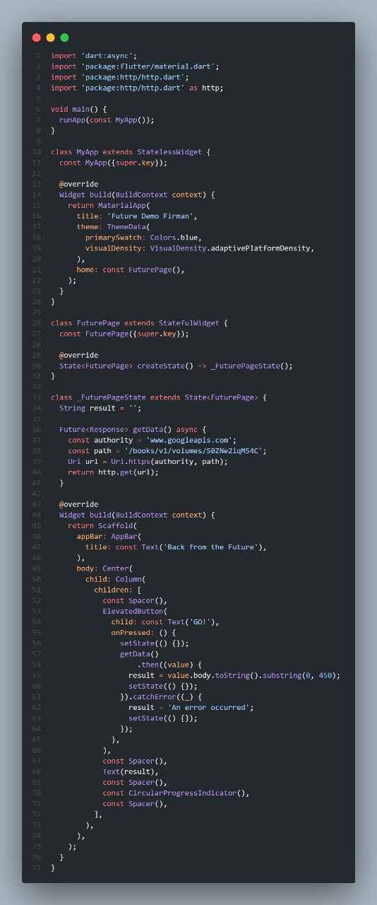
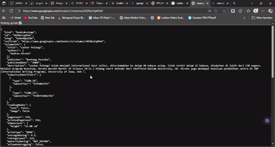
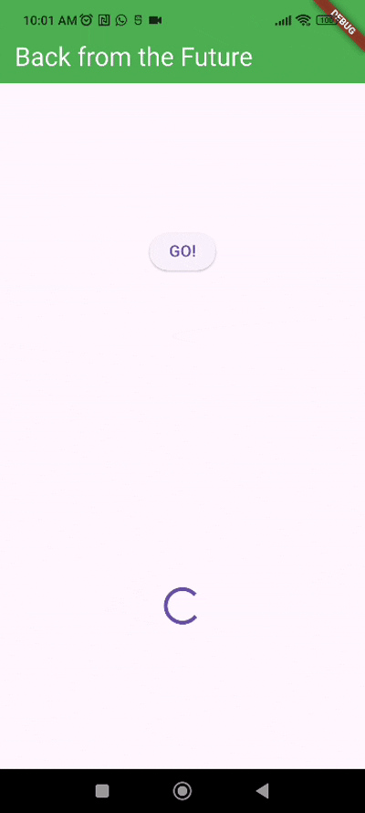
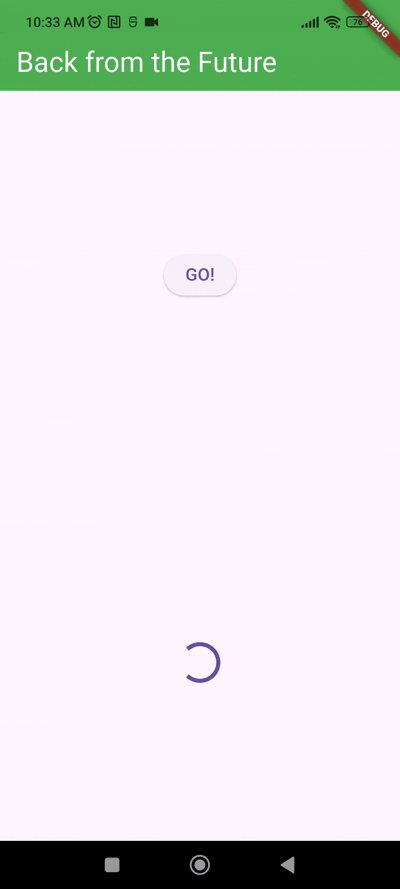
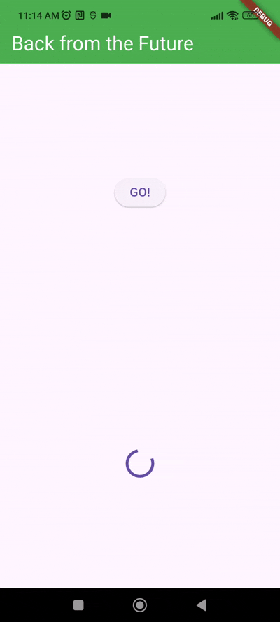
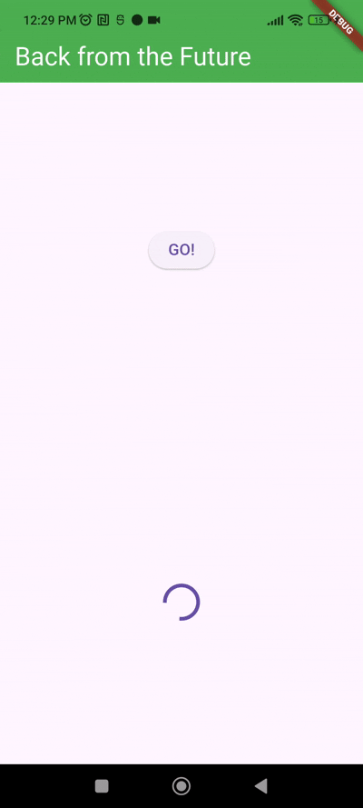
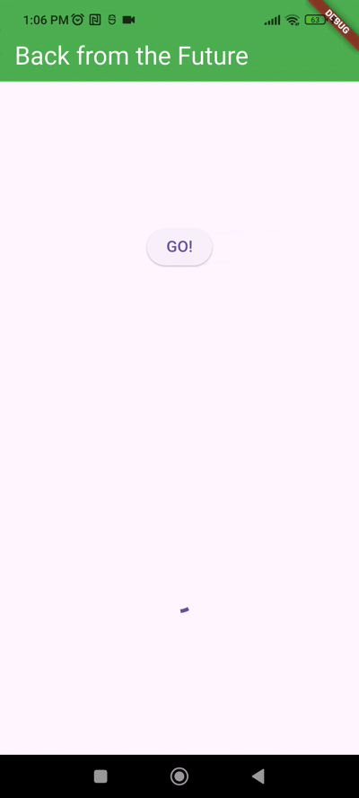
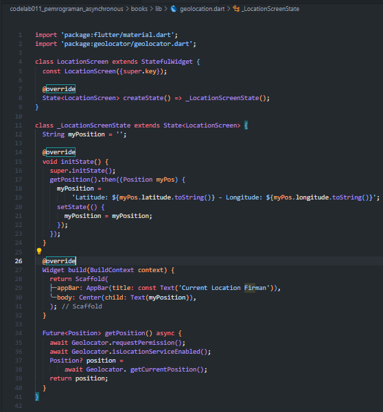
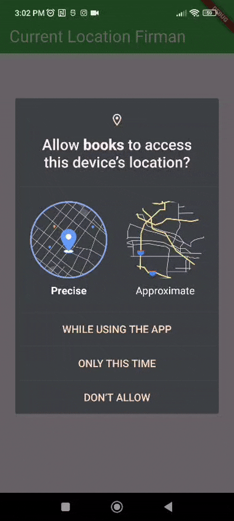
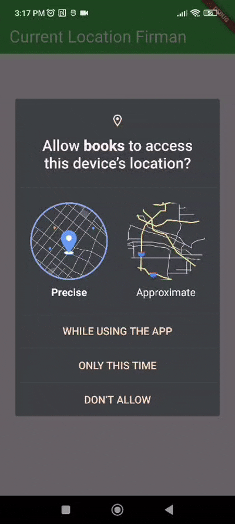

# Laporan Praktikum

# 11 | Pemrograman Asynchronous

# Pemrograman Mobile

### Nama : Mochammad Firmandika Jati Kusuma

### NIM : 2341720229

## Praktikum 1: Mengunduh Data dari Web Service (API)

## Soal 1
Tambahkan nama panggilan Anda pada title app sebagai identitas hasil pekerjaan Anda.

Jawab :

## Soal 2
- Carilah judul buku favorit Anda di Google Books, lalu ganti ID buku pada variabel path di kode tersebut. Caranya ambil di URL browser Anda seperti gambar berikut ini.

Jawab :

- Kemudian cobalah akses di browser URI tersebut dengan lengkap seperti ini. Jika menampilkan data JSON, maka Anda telah berhasil. Lakukan capture milik Anda dan tulis di README pada laporan praktikum. Lalu lakukan commit dengan pesan "W11: Soal 2".
    
Jawab :

## Soal 3
- Jelaskan maksud kode langkah 5 tersebut terkait substring dan catchError!

Jawab : Kode langkah 5 menggunakan substring(0, 450) untuk memotong response dari API Google Books agar hanya menampilkan 450 karakter pertama saja, karena data JSON lengkap dari API biasanya sangat panjang dan akan membuat tampilan berantakan. Sedangkan catchError berfungsi sebagai penangkap error yang akan menampilkan pesan "An error occurred" jika terjadi masalah saat mengambil data dari API, seperti tidak ada koneksi internet atau server tidak merespons. Dengan cara ini, aplikasi tetap bisa memberikan feedback kepada user baik ketika berhasil maupun gagal mengambil data.

- Capture hasil praktikum Anda berupa GIF dan lampirkan di README. Lalu lakukan commit dengan pesan "W11: Soal 3".

Jawab :
    

## Praktikum 2: Menggunakan await/async untuk menghindari callbacks

## Soal 4
Jelaskan maksud kode langkah 1 dan 2 tersebut!

Jawab : Langkah 1 membuat tiga method asynchronous (returnOneAsync, returnTwoAsync, returnThreeAsync) yang masing-masing mensimulasikan operasi yang membutuhkan waktu 3 detik menggunakan Future.delayed(), kemudian mengembalikan nilai integer 1, 2, dan 3 secara berurutan. Langkah 2 membuat method count() yang menjalankan ketiga method tersebut secara berurutan menggunakan await, sehingga total waktu eksekusi menjadi 9 detik (3+3+3), lalu menjumlahkan hasilnya (1+2+3=6) dan menampilkan total tersebut di UI melalui setState(). Kode ini mendemonstrasikan bagaimana operasi asynchronous berjalan secara sequential (berurutan) dimana setiap operasi harus menunggu operasi sebelumnya selesai terlebih dahulu.

Capture hasil praktikum Anda berupa GIF dan lampirkan di README. Lalu lakukan commit dengan pesan "W11: Soal 4".

Jawab :

## Praktikum 3: Menggunakan Completer di Future

## Soal 5
- Jelaskan maksud kode langkah 2 tersebut!

Jawab : Kode langkah 2 menggunakan Completer untuk membuat Future secara manual. Variabel late Completer completer dideklarasikan untuk menyimpan objek Completer yang akan dibuat nanti. Method getNumber() membuat Completer baru, memanggil calculate() untuk memulai proses asynchronous, lalu mengembalikan completer.future yang akan diselesaikan nanti. Method calculate() menunggu 5 detik menggunakan Future.delayed(), kemudian menyelesaikan Completer dengan nilai 42 menggunakan completer.complete(42). Ini adalah cara manual untuk mengontrol kapan dan bagaimana sebuah Future diselesaikan.

- Capture hasil praktikum Anda berupa GIF dan lampirkan di README. Lalu lakukan commit dengan pesan "W11: Soal 5".

Jawab :

## Soal 6
- Jelaskan maksud perbedaan kode langkah 2 dengan langkah 5-6 tersebut!

Jawab : Perbedaan utama antara langkah 2 dengan langkah 5-6 adalah penanganan error. Pada langkah 2, kode hanya menangani skenario sukses dimana Completer selalu diselesaikan dengan nilai 42 tanpa ada mekanisme error handling. Sedangkan pada langkah 5-6, ditambahkan try-catch block di method calculate() untuk menangkap exception dan menggunakan completer.completeError({}) untuk menyelesaikan Future dengan error. Di sisi UI, langkah 6 menambahkan .catchError() pada onPressed() untuk menangkap error tersebut dan menampilkan pesan "An error occurred". Dengan demikian, langkah 5-6 membuat aplikasi lebih robust dengan kemampuan menangani baik kondisi sukses maupun error.

- Capture hasil praktikum Anda berupa GIF dan lampirkan di README. Lalu lakukan commit dengan pesan "W11: Soal 6".

Jawab :

## Praktikum 4: Memanggil Future secara paralel

## Soal 7
Capture hasil praktikum Anda berupa GIF dan lampirkan di README. Lalu lakukan commit dengan pesan "W11: Soal 7".

Jawab :

## Soal 8
Jelaskan maksud perbedaan kode langkah 1 dan 4!

Jawab : Perbedaan utama antara langkah 1 dan langkah 4 terletak pada cara mengelola beberapa Future yang berjalan secara paralel. Pada langkah 1, menggunakan FutureGroup dari package async yang memerlukan beberapa langkah: membuat instance FutureGroup, menambahkan Future satu per satu dengan method .add(), kemudian menutup group dengan .close() sebelum bisa mengakses hasilnya melalui futureGroup.future. Sedangkan pada langkah 4, menggunakan Future.wait() yang merupakan method built-in dari Dart yang lebih sederhana dan langsung, dimana semua Future dimasukkan ke dalam sebuah array/list sebagai parameter, tanpa perlu proses add dan close. Kedua pendekatan menghasilkan output yang sama (menjalankan Future secara paralel dan mengembalikan List hasil), namun Future.wait() lebih ringkas, efisien, dan tidak memerlukan dependency tambahan dari package eksternal.

## Praktikum 5: Menangani Respon Error pada Async Code

## Soal 9
Capture hasil praktikum Anda berupa GIF dan lampirkan di README. Lalu lakukan commit dengan pesan "W11: Soal 9".

Jawab : 

## Soal 10
Panggil method handleError() tersebut di ElevatedButton, lalu run. Apa hasilnya? Jelaskan perbedaan kode langkah 1 dan 4!

Jawab : Ketika method handleError() dipanggil di ElevatedButton dan aplikasi dijalankan, setelah 2 detik akan muncul teks "Something terrible happened!" dalam format bold di layar, dan di console akan tercetak "Complete". Perbedaan utama antara langkah 1 dan langkah 4 adalah cara penanganan error. Langkah 1 menggunakan method returnError() yang hanya melempar exception tanpa menanganinya, sehingga error harus ditangani oleh pemanggil menggunakan .then().catchError().whenComplete(). Sedangkan langkah 4 menggunakan method handleError() yang sudah menangani error secara internal dengan try-catch-finally, sehingga error langsung diproses di dalam method tersebut dan UI langsung diupdate tanpa perlu chain method tambahan. Pendekatan langkah 4 lebih clean dan mudah dibaca karena menggunakan syntax async/await dengan try-catch-finally yang lebih terstruktur dibanding callback chain.

## Praktikum 6: Menggunakan Future dengan StatefulWidget

## Soal 11
Tambahkan nama panggilan Anda pada tiap properti title sebagai identitas pekerjaan Anda.

Jawab :

## Soal 12
- Jika Anda tidak melihat animasi loading tampil, kemungkinan itu berjalan sangat cepat. Tambahkan delay pada method getPosition() dengan kode await Future.delayed(const Duration(seconds: 3));

Jawab : 

- Apakah Anda mendapatkan koordinat GPS ketika run di browser? Mengapa demikian?

Jawab : Ya, Saya bisa mendapatkan koordinat GPS ketika run di browser. Hal ini dimungkinkan karena browser modern memiliki Geolocation API yang merupakan fitur bawaan HTML5. Ketika aplikasi Flutter dijalankan di browser, plugin geolocator akan menggunakan API ini untuk mengakses lokasi perangkat. Browser akan meminta izin kepada pengguna terlebih dahulu melalui popup permission, dan jika diizinkan, browser dapat mengakses lokasi melalui beberapa metode seperti GPS (jika perangkat memilikinya), WiFi positioning, atau IP address geolocation. Namun, akurasi lokasi di browser mungkin berbeda dengan aplikasi native karena tergantung pada metode yang digunakan browser dan pengaturan privasi pengguna. Selain itu, fitur geolocation di browser hanya berfungsi jika website diakses melalui protokol HTTPS atau localhost karena alasan keamanan.

- Capture hasil praktikum Anda berupa GIF dan lampirkan di README. Lalu lakukan commit dengan pesan "W11: Soal 12".

Jawab :

## Praktikum 7: Manajemen Future dengan FutureBuilder

## Soal 13
- Apakah ada perbedaan UI dengan praktikum sebelumnya? Mengapa demikian?

Jawab : Tidak ada perbedaan UI yang signifikan dengan praktikum sebelumnya. Kedua implementasi menampilkan loading indicator (CircularProgressIndicator) saat menunggu data lokasi, kemudian menampilkan teks koordinat setelah data diperoleh. Perbedaan utama terletak pada pendekatan implementasinya, bukan pada tampilan visual. Praktikum sebelumnya menggunakan pendekatan manual dengan .then() dan setState() untuk mengupdate UI, sedangkan praktikum ini menggunakan FutureBuilder yang merupakan widget khusus Flutter untuk menangani Future secara otomatis. FutureBuilder lebih efisien karena secara otomatis mengelola state berdasarkan status koneksi (waiting, done, error) tanpa perlu memanggil setState() secara manual. Meskipun hasilnya sama, FutureBuilder memberikan kode yang lebih bersih, mudah dibaca, dan mengikuti best practice Flutter dalam menangani operasi asynchronous di dalam widget.

- Capture hasil praktikum Anda berupa GIF dan lampirkan di README. Lalu lakukan 
commit dengan pesan "W11: Soal 13".

Jawab :

- Seperti yang Anda lihat, menggunakan FutureBuilder lebih efisien, clean, dan reactive dengan Future bersama UI.

## Soal 14
- Apakah ada perbedaan UI dengan langkah sebelumnya? Mengapa demikian?

Jawab : Tidak ada perbedaan UI dengan langkah sebelumnya jika aplikasi berjalan normal tanpa error. UI tetap menampilkan loading indicator (CircularProgressIndicator) saat menunggu, kemudian menampilkan koordinat lokasi setelah data diperoleh. Perbedaan hanya terlihat ketika terjadi error atau masalah dalam mengambil data lokasi. Pada langkah sebelumnya, jika terjadi error, aplikasi mungkin crash atau menampilkan pesan error default dari Flutter. Sedangkan pada langkah ini, dengan penambahan if (snapshot.hasError), aplikasi akan menampilkan pesan error yang user-friendly yaitu "Something terrible happened!" tanpa crash. Jadi, handling error ini berfungsi sebagai safety net untuk memberikan pengalaman pengguna yang lebih baik ketika terjadi masalah seperti permission ditolak, GPS tidak aktif, atau koneksi gagal. Dalam kondisi normal, UI tetap sama karena error handling hanya aktif saat ada masalah.

- Capture hasil praktikum Anda berupa GIF dan lampirkan di README. Lalu lakukan commit dengan pesan "W11: Soal 14".

Jawab :

## Praktikum 8: Navigation route dengan Future Function

## Soal 15
- Tambahkan nama panggilan Anda pada tiap properti title sebagai identitas pekerjaan Anda.

Jawab :

- Silakan ganti dengan warna tema favorit Anda.

Jawab :

## Soal 16
- Cobalah klik setiap button, apa yang terjadi ? Mengapa demikian ?

Jawab : Ketika setiap button diklik, background color pada halaman pertama (Navigation First Screen) akan berubah sesuai dengan warna button yang dipilih. Hal ini terjadi karena aplikasi menggunakan konsep navigation dengan return value. Saat button "Change Color" diklik di halaman pertama, aplikasi akan menavigasi ke halaman kedua menggunakan Navigator.push() yang mengembalikan sebuah Future. Ketika salah satu button warna (Red, Green, atau Blue) diklik di halaman kedua, method Navigator.pop(context, color) akan menutup halaman kedua dan mengembalikan nilai warna yang dipilih ke halaman pertama. Method _navigateAndGetColor() yang bersifat async akan menunggu (await) hasil dari navigasi tersebut, kemudian menyimpan warna yang dikembalikan ke variabel color dan memanggil setState() untuk memperbarui UI. Jika user menekan tombol back tanpa memilih warna, aplikasi akan menggunakan warna default Colors.blue karena operator null-coalescing (??). Dengan demikian, background halaman pertama akan berubah secara dinamis sesuai pilihan user, mendemonstrasikan komunikasi data antar halaman menggunakan async/await dan navigation return value.

- Gantilah 3 warna pada langkah 5 dengan warna favorit Anda!

Jawab :

- Capture hasil praktikum Anda berupa GIF dan lampirkan di README. Lalu lakukan commit dengan pesan "W11: Soal 16"

Jawab :

## Praktikum 9: Memanfaatkan async/await dengan Widget Dialog

## Soal 17
- Cobalah klik setiap button, apa yang terjadi ? Mengapa demikian ?

Jawab : Ketika button "Change Color" diklik, akan muncul dialog popup dengan judul "Very important question" dan pesan "Please choose a color" beserta tiga pilihan button warna (Red, Green, Blue). Saat salah satu button warna diklik, dialog akan tertutup dan background layar akan berubah sesuai warna yang dipilih. Hal ini terjadi karena aplikasi menggunakan showDialog() dengan barrierDismissible: false, yang berarti dialog hanya bisa ditutup dengan menekan salah satu button pilihan, bukan dengan tap di luar dialog. Method _showColorDialog() bersifat async dan menunggu hasil dari dialog menggunakan await. Ketika user memilih warna, Navigator.pop(context, color) menutup dialog dan mengembalikan nilai warna yang dipilih. Setelah dialog tertutup, setState() dipanggil untuk memperbarui UI sehingga background berubah warna. Berbeda dengan praktikum sebelumnya yang menggunakan navigasi ke halaman baru, praktikum ini menggunakan dialog yang lebih efisien karena tidak perlu membuat halaman terpisah dan memberikan pengalaman user yang lebih cepat dengan popup yang muncul di atas layar yang sama.

- Gantilah 3 warna pada langkah 3 dengan warna favorit Anda!

Jawab :

- Capture hasil praktikum Anda berupa GIF dan lampirkan di README. Lalu lakukan commit dengan pesan "W11: Soal 17".

Jawab :

