# Laporan Praktikum

# 12 | Streams

# Pemrograman Mobile

### Nama : Mochammad Firmandika Jati Kusuma

### NIM : 2341720229

## Praktikum 1: Dart Streams

## Soal 1
Tambahkan nama panggilan Anda pada title app sebagai identitas hasil pekerjaan Anda.

Jawab :

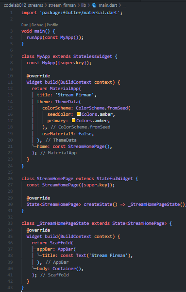

Gantilah warna tema aplikasi sesuai kesukaan Anda.

Jawab :

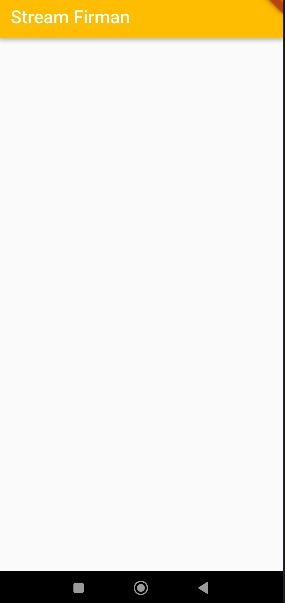

Lakukan commit hasil jawaban Soal 1 dengan pesan "W12: Jawaban Soal 1"

Jawab :

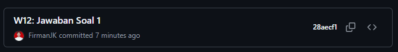

## Soal 2
Tambahkan 5 warna lainnya sesuai keinginan Anda pada variabel colors tersebut.

Jawab :

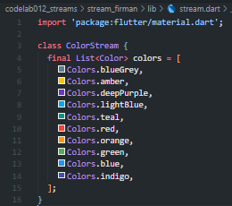

Lakukan commit hasil jawaban Soal 2 dengan pesan "W12: Jawaban Soal 2"

Jawab :

## Soal 3
Jelaskan fungsi keyword yield* pada kode tersebut!

Jawab : Keyword yield* pada kode tersebut berfungsi untuk mendelegasikan atau meneruskan semua nilai dari stream lain ke dalam stream yang sedang dibuat. Dalam konteks ini, yield* akan menghasilkan nilai-nilai secara periodik dari Stream.periodic() ke stream utama, sehingga semua output dari stream periodic tersebut akan disalurkan atau di-forward secara otomatis.

Apa maksud isi perintah kode tersebut?

Jawab : Maksud dari perintah kode tersebut adalah membuat sebuah generator function yang menghasilkan stream warna secara periodik. Setiap 1 detik, fungsi akan dipanggil dengan parameter t yang merupakan counter atau penghitung yang bertambah setiap kali fungsi dipanggil dimulai dari 0, 1, 2, 3, dan seterusnya. Kemudian int index = t % colors.length; menghitung index dengan operasi modulo sehingga index akan berputar dari 0 sampai panjang list colors, lalu kembali ke 0 lagi. Setelah itu return colors[index]; mengembalikan warna pada index tersebut. Hasilnya adalah stream akan mengeluarkan warna-warna dari list colors secara berurutan dan berulang setiap 1 detik.

Lakukan commit hasil jawaban Soal 3 dengan pesan "W12: Jawaban Soal 3"

Jawab :

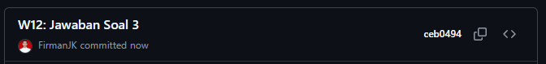

## Soal 4
Capture hasil praktikum Anda berupa GIF dan lampirkan di README.

Jawab :

Lakukan commit hasil jawaban Soal 4 dengan pesan "W12: Jawaban Soal 4"

Jawab :

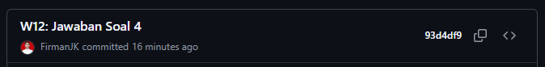

## Soal 5
Jelaskan perbedaan menggunakan listen dan await for (langkah 9) !

Jawab : Perbedaan utama antara listen dan await for terletak pada cara eksekusi kode. Ketika menggunakan await for, kode akan berjalan secara sinkron dan memblokir eksekusi kode lainnya sampai stream selesai atau dibatalkan, sehingga kode setelah loop await for tidak akan dijalankan sampai stream berakhir. Sedangkan listen bersifat asinkron dan tidak memblokir eksekusi kode, sehingga kode setelah listen akan langsung dijalankan tanpa menunggu stream selesai. Dalam konteks praktis, listen lebih fleksibel karena memungkinkan kita untuk melanjutkan eksekusi kode lain sambil tetap mendengarkan perubahan dari stream, dan juga menyediakan callback tambahan seperti onError dan onDone untuk menangani error dan penyelesaian stream.

Lakukan commit hasil jawaban Soal 5 dengan pesan "W12: Jawaban Soal 5"

Jawab :

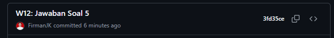

## Praktikum 2: Stream controllers dan sinks

## Soal 6
Jelaskan maksud kode langkah 8 dan 10 tersebut!

Jawab : Pada langkah 8 (initState), kode tersebut berfungsi untuk menginisialisasi stream saat widget pertama kali dibuat. Pertama, dibuat instance NumberStream yang kemudian diambil controller-nya untuk mengakses stream. Stream tersebut kemudian di-listen menggunakan method listen() yang akan mendengarkan setiap data baru yang masuk. Setiap kali ada data (event) yang dikirim ke stream, maka setState() akan dipanggil untuk memperbarui nilai variabel lastNumber dengan nilai event tersebut, sehingga UI akan otomatis ter-refresh dan menampilkan angka terbaru.

Pada langkah 10 (addRandomNumber), kode tersebut berfungsi untuk menghasilkan dan mengirim angka acak ke dalam stream. Method ini membuat instance Random, kemudian menghasilkan angka acak antara 0-9 menggunakan nextInt(10), dan angka tersebut dikirim ke dalam stream melalui method addNumberToSink(). Ketika angka ini masuk ke stream, listener yang sudah dibuat di initState akan menangkapnya dan memperbarui tampilan dengan angka baru tersebut.

Capture hasil praktikum Anda berupa GIF dan lampirkan di README.

Jawab : 

Lalu lakukan commit dengan pesan "W12: Jawaban Soal 6".

Jawab :

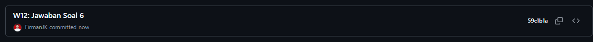

## Soal 7
Jelaskan maksud kode langkah 13 sampai 15 tersebut!

Jawab : Kode pada langkah 13 sampai 15 bertujuan untuk mendemonstrasikan error handling pada stream. Pada langkah 13, ditambahkan method addError() di class NumberStream yang berfungsi untuk mengirimkan error ke dalam stream menggunakan controller.sink.addError(). Pada langkah 14, ditambahkan handler onError() pada listener stream di initState() yang akan menangkap error tersebut dan mengubah nilai lastNumber menjadi -1 ketika terjadi error. Pada langkah 15, method addRandomNumber() dimodifikasi dengan meng-comment kode yang menghasilkan angka acak dan menggantinya dengan pemanggilan numberStream.addError(), sehingga setiap kali tombol ditekan, aplikasi akan mengirim error ke stream dan menampilkan angka -1 di layar sebagai indikasi bahwa error telah ditangani dengan baik.

Kembalikan kode seperti semula pada Langkah 15, comment addError() agar Anda dapat melanjutkan ke praktikum 3 berikutnya.

Jawab :

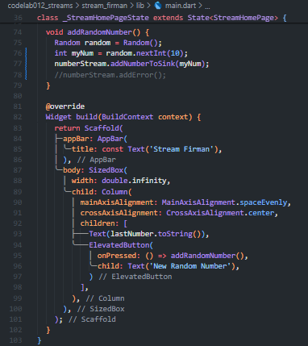

Lalu lakukan commit dengan pesan "W12: Jawaban Soal 7".

Jawab :

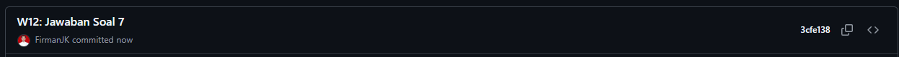

## Praktikum 3: Injeksi data ke streams

## Soal 8
Jelaskan maksud kode langkah 1-3 tersebut!

Jawab : Kode pada langkah 1 sampai 3 bertujuan untuk mendemonstrasikan penggunaan StreamTransformer yang berfungsi untuk memodifikasi atau mentransformasi data yang mengalir melalui stream sebelum sampai ke listener. Pada langkah 1, dideklarasikan variabel transformer bertipe StreamTransformer. Pada langkah 2, transformer diinisialisasi dengan menggunakan fromHandlers yang memiliki tiga handler: handleData untuk memproses data normal dengan mengalikan nilai dengan 10 sebelum dikirim ke sink, handleError untuk menangani error dengan mengirim nilai -1, dan handleDone untuk menutup sink ketika stream selesai. Pada langkah 3, transformer diterapkan pada stream menggunakan method transform() sebelum listen(), sehingga setiap angka acak yang dihasilkan akan otomatis dikalikan 10 terlebih dahulu sebelum ditampilkan di layar, misalnya jika angka acak adalah 5 maka yang ditampilkan adalah 50.

Capture hasil praktikum Anda berupa GIF dan lampirkan di README.

Jawab :

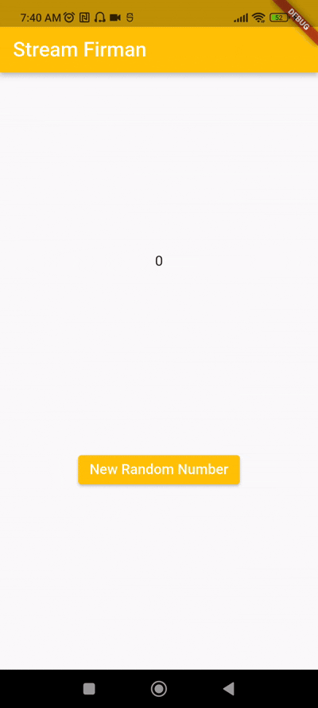

Lalu lakukan commit dengan pesan "W12: Jawaban Soal 8".

Jawab :

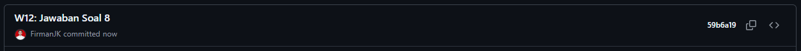

## Praktikum 4: Subscribe ke stream events

## Soal 9
Jelaskan maksud kode langkah 2, 6 dan 8 tersebut!

Jawab : Pada langkah 2, kode diubah untuk menggunakan StreamSubscription yang menyimpan referensi hasil dari stream.listen() ke dalam variabel subscription. Berbeda dengan sebelumnya yang menggunakan transformer, sekarang stream langsung di-listen dan hasilnya disimpan dalam subscription agar bisa dikontrol lebih lanjut. Subscription ini kemudian ditambahkan handler onError dan onDone secara terpisah untuk menangani error dan event selesai dari stream.

Pada langkah 6, method dispose() diubah untuk memanggil subscription.cancel() menggantikan numberStreamController.close(). Hal ini penting karena ketika widget dihancurkan, kita perlu membatalkan subscription untuk mencegah memory leak dan memastikan listener tidak lagi menerima event dari stream yang sudah tidak digunakan. Method cancel() akan menghentikan subscription dari mendengarkan stream.

Pada langkah 8, method addRandomNumber() ditambahkan pengecekan kondisi menggunakan !numberStreamController.isClosed sebelum menambahkan data ke stream. Jika controller sudah ditutup (closed), maka alih-alih menambahkan data yang akan menyebabkan error, aplikasi akan mengubah lastNumber menjadi -1 untuk memberi indikasi bahwa stream sudah tidak aktif. Ini mencegah error yang terjadi ketika mencoba mengirim data ke stream yang sudah ditutup.

Capture hasil praktikum Anda berupa GIF dan lampirkan di README.

Jawab :

Lalu lakukan commit dengan pesan "W12: Jawaban Soal 9".

Jawab :

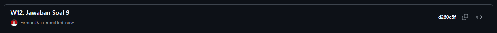

## Praktikum 5: Multiple stream subscriptions

## Soal 10
Jelaskan mengapa error itu bisa terjadi ?

Jawab : Berdasarkan kode yang saya lihat, error "Bad state: Stream has already been listened to" terjadi karena ada dua subscription yang mencoba mendengarkan stream yang sama secara bersamaan. Pada method initState(), kode membuat dua listener yaitu subscription dan subscription2 yang keduanya mendengarkan stream yang sama (numberStreamController.stream). Secara default, stream di Dart bersifat single-subscription, yang berarti hanya boleh memiliki satu listener aktif pada satu waktu. Ketika subscription kedua (subscription2) mencoba mendengarkan stream yang sudah didengarkan oleh subscription pertama, Flutter melempar error tersebut karena melanggar aturan single-subscription stream. Untuk mengatasi masalah ini, Anda perlu mengubah stream menjadi broadcast stream menggunakan method asBroadcastStream() yang memungkinkan multiple listeners, atau cukup menghapus salah satu subscription yang tidak diperlukan.

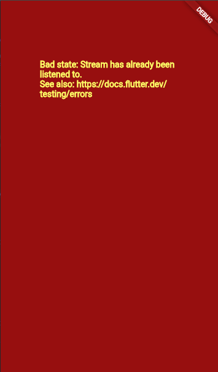

## Soal 11
Jelaskan mengapa hal itu bisa terjadi ?

Jawab : Autofix atau formatting terjadi pada file main.dart karena editor mendeteksi adanya penyimpangan dari aturan formatting standar Dart setelah saya melakukan perubahan kode. Ketika kode dimodifikasi, terutama saat menambahkan atau mengubah baris kode seperti penambahan .asBroadcastStream(), bisa jadi ada inkonsistensi dalam hal indentasi, spasi, atau struktur penulisan yang tidak sesuai dengan style guide Dart. Editor secara otomatis menjalankan formatter (biasanya dart format) untuk memastikan kode tetap rapi dan konsisten dengan konvensi penulisan Dart yang standar, seperti penggunaan spasi yang tepat, line breaks, dan indentasi yang seragam. Ini adalah fitur yang membantu menjaga kualitas dan keterbacaan kode secara otomatis tanpa perlu intervensi manual dari developer.

Capture hasil praktikum Anda berupa GIF dan lampirkan di README.

Jawab :

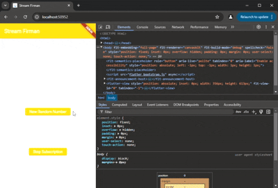

Lalu lakukan commit dengan pesan "W12: Jawaban Soal 10,11".

Jawab :

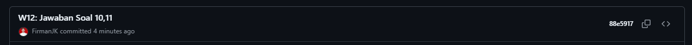

## Praktikum 6: StreamBuilder

## Soal 12
Jelaskan maksud kode pada langkah 3 dan 7 !

Jawab : Pada langkah 3, kode membuat class NumberStream yang berfungsi sebagai wrapper untuk mengelola stream data integer. Class ini memiliki StreamController<int> yang bertugas mengontrol aliran data, serta method addNumberToSink() untuk menambahkan angka baru ke dalam stream, addError() untuk mengirim error, dan close() untuk menutup stream. Method getNumbers() yang dipanggil di initState() seharusnya mengembalikan stream dari controller tersebut, sehingga widget bisa mendengarkan perubahan data yang dikirim melalui stream ini secara asynchronous.

Pada langkah 7, kode menggunakan widget StreamBuilder yang secara otomatis mendengarkan perubahan data dari stream dan membangun ulang UI setiap kali ada data baru. Parameter stream menentukan sumber data yang akan didengarkan, initialData: 0 memberikan nilai awal sebelum data pertama datang, dan builder adalah fungsi yang menentukan tampilan berdasarkan kondisi snapshot. Jika ada error, akan mencetak pesan error; jika ada data, akan menampilkan angka tersebut di tengah layar dengan ukuran font 96; dan jika tidak ada data, akan menampilkan widget kosong. Pendekatan ini lebih efisien dibanding menggunakan setState() manual karena StreamBuilder mengelola subscription dan rebuild secara otomatis.

Capture hasil praktikum Anda berupa GIF dan lampirkan di README.

Jawab :

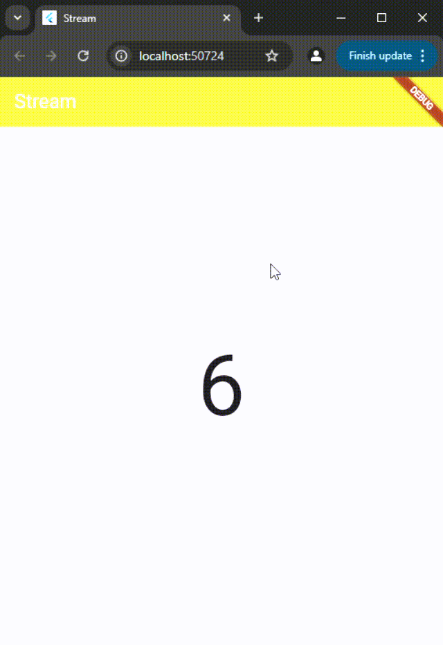

Lalu lakukan commit dengan pesan "W12: Jawaban Soal 12".

Jawab :

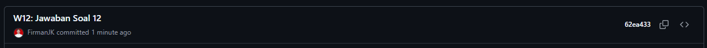

## Praktikum 7: BLoC Pattern

## Soal 13
Jelaskan maksud praktikum ini ! Dimanakah letak konsep pola BLoC-nya ?

Jawab : Praktikum ini bertujuan untuk memahami dan mengimplementasikan pola arsitektur BLoC (Business Logic Component) dalam Flutter menggunakan Stream sebagai mekanisme komunikasi antara UI dan business logic. Konsep utamanya adalah memisahkan logika bisnis dari tampilan UI, sehingga kode menjadi lebih terstruktur, mudah diuji, dan dapat digunakan kembali. Dalam praktikum ini, aplikasi menampilkan angka random yang dihasilkan setiap kali user menekan tombol floating action button, dimana proses generate angka random ditangani oleh BLoC, bukan langsung di widget.

Letak konsep pola BLoC-nya ada di file random_bloc.dart, khususnya pada class RandomNumberBloc. Di sini terdapat dua StreamController: _generateRandomController sebagai input stream yang menerima event dari UI (ketika user menekan tombol), dan _randomNumberController sebagai output stream yang mengirim data hasil (angka random) kembali ke UI. Pola BLoC terlihat jelas pada pemisahan tanggung jawab: UI (random_screen.dart) hanya bertugas menampilkan data dan mengirim event melalui Sink, sementara BLoC menangani semua logika bisnis (generate angka random) dan mengirim hasilnya melalui Stream. Widget menggunakan StreamBuilder untuk mendengarkan perubahan data dari BLoC secara reaktif, sehingga UI otomatis terupdate ketika ada data baru tanpa perlu memanggil setState() secara manual.

Capture hasil praktikum Anda berupa GIF dan lampirkan di README.

Jawab :

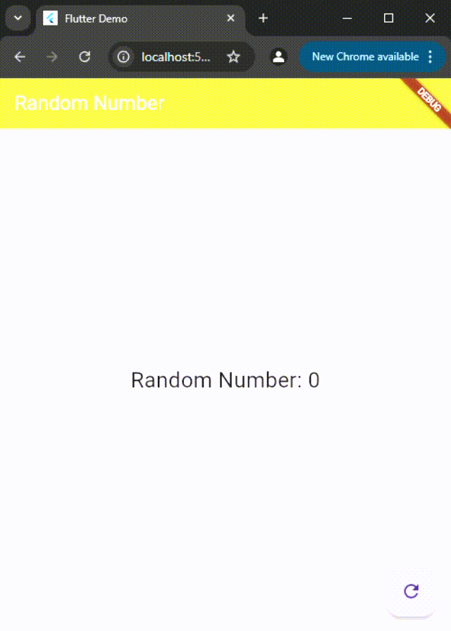

Lalu lakukan commit dengan pesan "W12: Jawaban Soal 13".

Jawab :

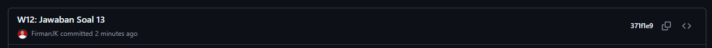

