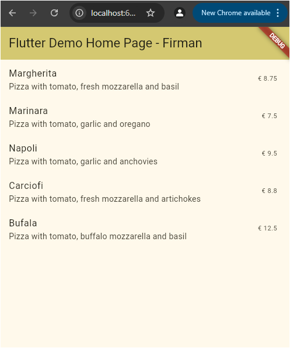
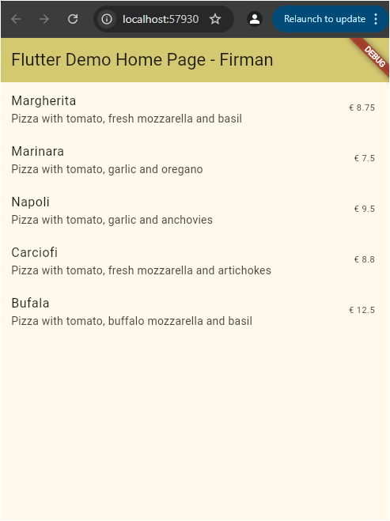
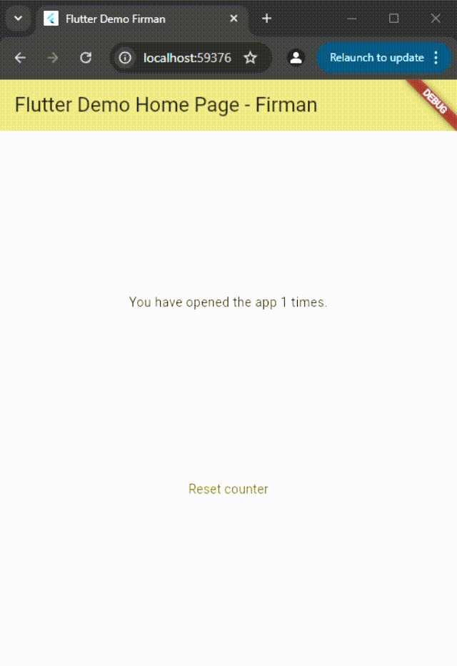
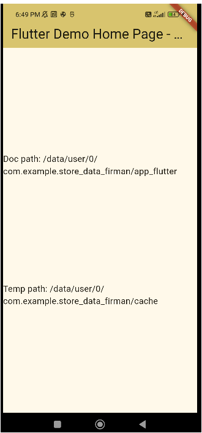
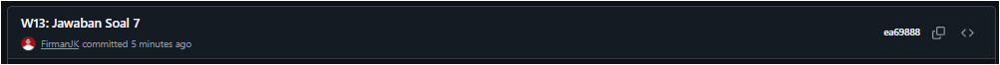
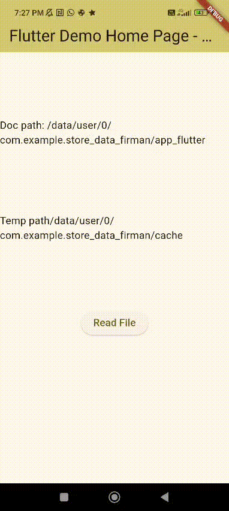
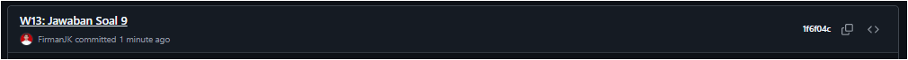

# Laporan Praktikum

# 13 | Persistensi Data

# Pemrograman Mobile

### Nama : Mochammad Firmandika Jati Kusuma

### NIM : 2341720229

## Praktikum 1: Konversi Dart model ke JSON

## Soal 1
Tambahkan nama panggilan Anda pada title app sebagai identitas hasil pekerjaan Anda.

Jawab :

Gantilah warna tema aplikasi sesuai kesukaan Anda.

Jawab : 

Lakukan commit hasil jawaban Soal 1 dengan pesan "W13: Jawaban Soal 1"

Jawab :

## Soal 2
Masukkan hasil capture layar ke laporan praktikum Anda.

Jawab :

Lakukan commit hasil jawaban Soal 2 dengan pesan "W13: Jawaban Soal 2"

Jawab :

## Soal 3
Masukkan hasil capture layar ke laporan praktikum Anda.

Jawab :

Lakukan commit hasil jawaban Soal 2 dengan pesan "W13: Jawaban Soal 3"

Jawab :

## Praktikum 2: Handle kompatibilitas data JSON

## Soal 4
Capture hasil running aplikasi Anda, kemudian impor ke laporan praktikum Anda!

Jawab :

Lalu lakukan commit dengan pesan "W13: Jawaban Soal 4".

Jawab :

## Praktikum 3: Menangani error JSON

## Soal 5
Jelaskan maksud kode lebih safe dan maintainable!

Jawab : 

Dengan menggunakan konstanta untuk kunci JSON, kode menjadi lebih aman dan mudah dipelihara karena menghindari kesalahan penulisan string literal (typo) yang sulit dideteksi saat kompilasi. Jika ada perubahan nama field di JSON, kita hanya perlu mengubah nilai konstanta di satu tempat, bukan mencari dan mengganti string literal di banyak lokasi. Selain itu, editor dapat memberikan autocomplete dan error checking yang lebih baik saat menggunakan konstanta, sehingga mengurangi risiko bug akibat salah ketik nama field. Pendekatan ini juga memudahkan refactoring dan membuat kode lebih konsisten karena semua referensi ke field JSON menggunakan konstanta yang sama.

Capture hasil praktikum Anda dan lampirkan di README.

Jawab : 

Lalu lakukan commit dengan pesan "W13: Jawaban Soal 5".

Jawab : 

## Praktikum 4: SharedPreferences

## Soal 6
Capture hasil praktikum Anda berupa GIF dan lampirkan di README.

Jawab : 

Lalu lakukan commit dengan pesan "W13: Jawaban Soal 6".

Jawab : 

## Praktikum 5: Akses filesystem dengan path_provider

## Soal 7
Capture hasil praktikum Anda dan lampirkan di README.

Jawab : 

Lalu lakukan commit dengan pesan "W13: Jawaban Soal 7".

Jawab : 

## Praktikum 6: Akses filesystem dengan direktori

## Soal 8
Jelaskan maksud kode pada langkah 3 dan 7 !

Jawab : 

- Penjelasan Langkah 3 - Method writeFile():

Method writeFile() adalah fungsi asinkron yang bertugas menulis data ke dalam file. Method ini menggunakan myFile.writeAsString() untuk menyimpan teks 'Margherita, Capricciosa, Napoli' ke dalam file pizzas.txt yang berada di direktori dokumen aplikasi. Fungsi ini dibungkus dalam blok try-catch untuk menangani kemungkinan error saat proses penulisan file. Jika penulisan berhasil, method akan mengembalikan nilai true, namun jika terjadi error (misalnya permission denied atau storage penuh), method akan mengembalikan false. Ini adalah contoh implementasi persistensi data menggunakan file system di Flutter.

- Penjelasan Langkah 6 - Edit build() dan Tambahkan Tombol Baca:

Pada method build(), ditambahkan widget ElevatedButton yang berfungsi sebagai tombol untuk membaca isi file. Ketika tombol dengan label 'Read File' ditekan, tombol ini akan memanggil method readFile() yang akan membaca konten dari file pizzas.txt. Setelah tombol, terdapat widget Text(fileText) yang menampilkan isi variabel fileText di layar. Ketika pengguna menekan tombol, method readFile() akan membaca file, mengupdate state dengan setState(), dan konten file akan ditampilkan di widget Text tersebut. Ini memungkinkan pengguna untuk melihat data yang telah disimpan sebelumnya di file.

Capture hasil praktikum Anda berupa GIF dan lampirkan di README.

Jawab : 

Lalu lakukan commit dengan pesan "W13: Jawaban Soal 8".

Jawab : 

## Praktikum 7: Menyimpan data dengan enkripsi/dekripsi

## Soal 9
Capture hasil praktikum Anda berupa GIF dan lampirkan di README.

Jawab : 

Lalu lakukan commit dengan pesan "W13: Jawaban Soal 9".

Jawab : 

