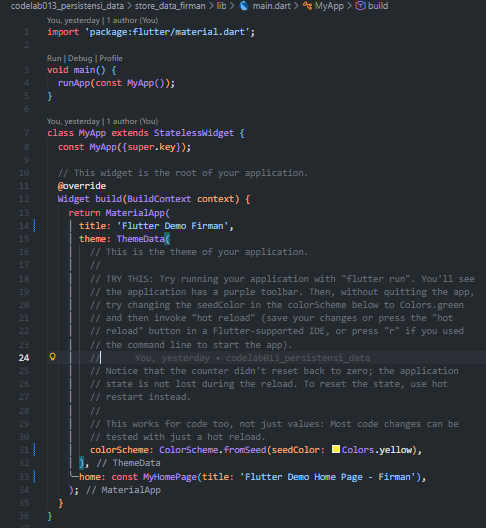
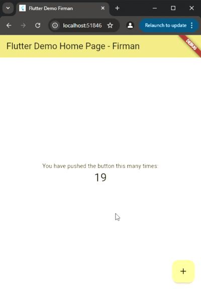
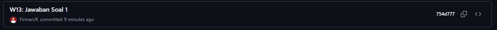
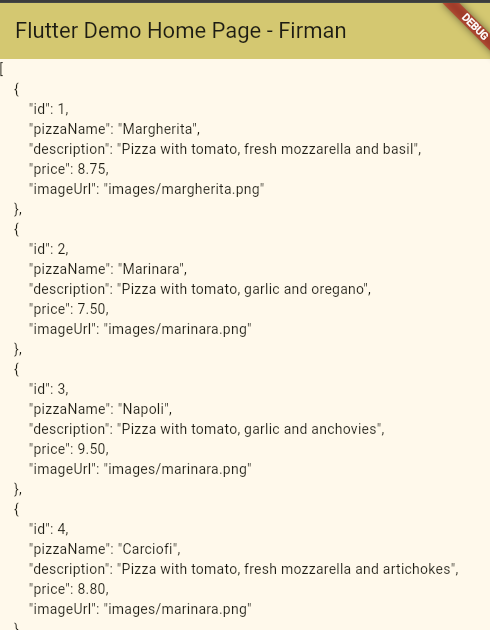
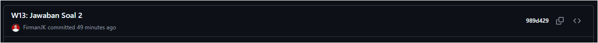
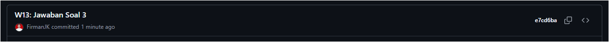

# Laporan Praktikum

# 13 | Persistensi Data

# Pemrograman Mobile

### Nama : Mochammad Firmandika Jati Kusuma

### NIM : 2341720229

## Praktikum 1: Konversi Dart model ke JSON

## Soal 1
Tambahkan nama panggilan Anda pada title app sebagai identitas hasil pekerjaan Anda.

Jawab :

Gantilah warna tema aplikasi sesuai kesukaan Anda.

Jawab : 

Lakukan commit hasil jawaban Soal 1 dengan pesan "W13: Jawaban Soal 1"

Jawab :

## Soal 2
Masukkan hasil capture layar ke laporan praktikum Anda.

Jawab :

Lakukan commit hasil jawaban Soal 2 dengan pesan "W13: Jawaban Soal 2"

Jawab :

## Soal 3
Masukkan hasil capture layar ke laporan praktikum Anda.

Jawab :

Lakukan commit hasil jawaban Soal 2 dengan pesan "W13: Jawaban Soal 3"

Jawab :

## Soal 4
Capture hasil running aplikasi Anda, kemudian impor ke laporan praktikum Anda!

Jawab :

Lalu lakukan commit dengan pesan "W13: Jawaban Soal 4".

Jawab :

## Soal 5
Jelaskan maksud kode lebih safe dan maintainable!

Jawab : 

Capture hasil praktikum Anda dan lampirkan di README.

Jawab : 

Lalu lakukan commit dengan pesan "W13: Jawaban Soal 5".

Jawab : 

## Soal 6
Capture hasil praktikum Anda berupa GIF dan lampirkan di README.

Jawab : 

Lalu lakukan commit dengan pesan "W13: Jawaban Soal 6".

Jawab : 

## Soal 7
Capture hasil praktikum Anda dan lampirkan di README.

Jawab : 

Lalu lakukan commit dengan pesan "W13: Jawaban Soal 7".

Jawab : 

## Soal 8
Jelaskan maksud kode pada langkah 3 dan 7 !

Jawab : 

Capture hasil praktikum Anda berupa GIF dan lampirkan di README.

Jawab : 

Lalu lakukan commit dengan pesan "W13: Jawaban Soal 8".

Jawab : 

## Soal 9
Capture hasil praktikum Anda berupa GIF dan lampirkan di README.

Jawab : 

Lalu lakukan commit dengan pesan "W13: Jawaban Soal 9".

Jawab : 

