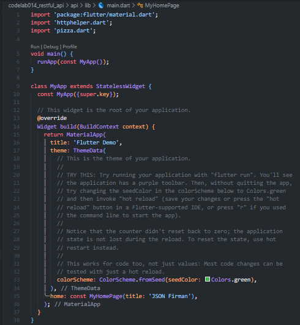
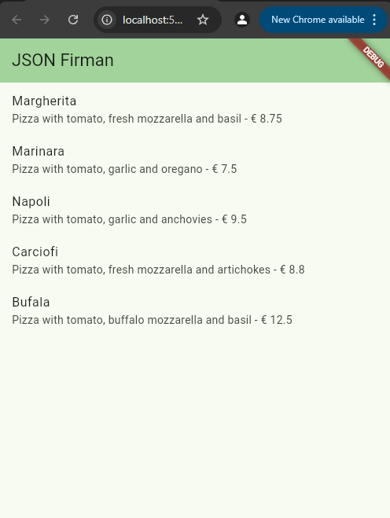
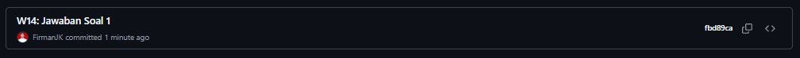
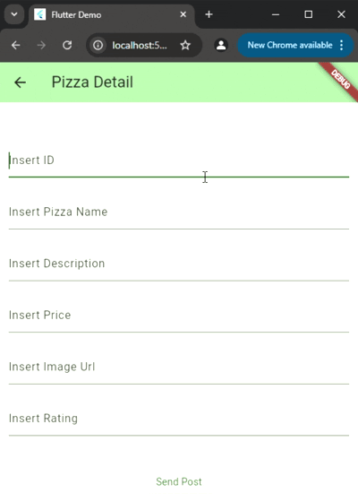
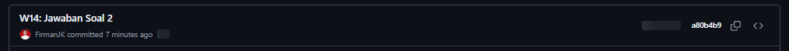
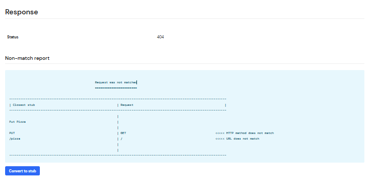
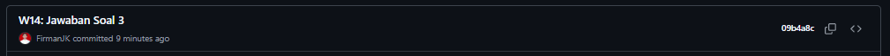

# Laporan Praktikum

# 14 | RESTful API

# Pemrograman Mobile

### Nama : Mochammad Firmandika Jati Kusuma

### NIM : 2341720229

## Praktikum 1: Membuat layanan Mock API

## Soal 1

Tambahkan nama panggilan Anda pada title app sebagai identitas hasil pekerjaan Anda.

Jawab :

Gantilah warna tema aplikasi sesuai kesukaan Anda.

Jawab :

Capture hasil aplikasi Anda, lalu masukkan ke laporan di README dan lakukan commit hasil jawaban Soal 1 dengan pesan "W14: Jawaban Soal 1"

Jawab :

## Soal 2

Tambahkan field baru dalam JSON maupun POST ke Wiremock!

Jawab :

Capture hasil aplikasi Anda berupa GIF di README dan lakukan commit hasil jawaban Soal 2 dengan pesan "W14: Jawaban Soal 2"

Jawab :

## Soal 3

Ubah salah satu data dengan Nama dan NIM Anda, lalu perhatikan hasilnya di Wiremock.

Jawab :

Capture hasil aplikasi Anda berupa GIF di README dan lakukan commit hasil jawaban Soal 3 dengan pesan "W14: Jawaban Soal 3"

Jawab :

## Soal 4

Capture hasil aplikasi Anda berupa GIF di README dan lakukan commit hasil jawaban Soal 4 dengan pesan "W14: Jawaban Soal 4"

Jawab :

