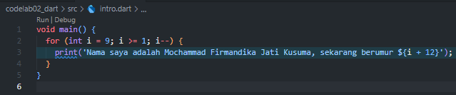
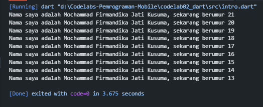
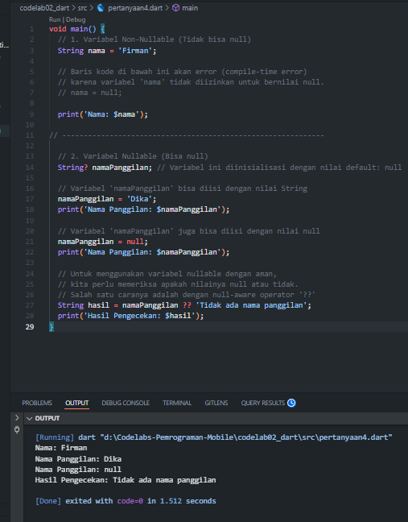

# 7. Tugas Praktikum

### Soal 1

Modifikasilah kode pada baris 3 di VS Code atau Editor Code favorit Anda berikut ini agar mendapatkan keluaran (output) sesuai yang diminta!

Output yang diminta (Gantilah Fulan dengan nama Anda):

### 

### Soal 2

Mengapa sangat penting untuk memahami bahasa pemrograman Dart sebelum kita menggunakan framework Flutter ? Jelaskan!

Jawab : Mempelajari Dart sebelum Flutter itu penting karena Dart adalah bahasa inti yang digunakan Flutter. Seluruh komponen, logika, dan fungsi di Flutter dibuat dengan Dart. Jika menguasai Dart nantinya akan lebih mudah memahami alur kerja, struktur kode, dan menyelesaikan masalah (debugging) dalam aplikasi Flutter. Ibarat membangun rumah harus paham cara menggunakan bahan dasar (Dart) sebelum bisa merakitnya menjadi bangunan utuh (Flutter).

### Soal 3

Rangkumlah materi dari codelab ini menjadi poin-poin penting yang dapat Anda gunakan untuk membantu proses pengembangan aplikasi mobile menggunakan framework Flutter.

Jawab : Dalam membangun aplikasi Flutter, ada beberapa poin-poin penting yang harus dikuasai.

1. Pertama, perlu memahami dasar-dasar pemrograman Dart, seperti variabel, tipe data, perulangan, percabangan, dan fungsi, yang menjadi fondasi kodenya.
2. Kedua, pahami konsep widget, karena semua elemen antarmuka (UI) di Flutter, mulai dari teks hingga tombol, adalah widget. Menguasai widget dasar dan cara mengelola tata letak serta navigasi antar halaman adalah kunci untuk membuat tampilan yang terstruktur.
3. Selain itu, penting juga untuk menguasai manajemen state agar Anda bisa mengelola dan memperbarui data yang berubah dalam aplikasi.
4. Terakhir, memperlajari konektivitas eksternal, yaitu cara berkomunikasi dengan server melalui API dan menyimpan data secara lokal.

### Soal 4

Buatlah penjelasan dan contoh eksekusi kode tentang perbedaan Null Safety dan Late variabel !

### 

Jawab : Null Safety dan late variable adalah fitur Dart untuk membuat kode lebih aman dan efisien.

- Null Safety mencegah kesalahan akibat nilai null. Secara bawaan, variabel di Dart tidak bisa null. Jika ingin variabel bisa bernilai null, cukup tambahkan tanda tanya (?) setelah tipe datanya. Ini membantu mencegah error saat program berjalan karena mengakses sesuatu yang tidak ada.

Contoh :
String name = 'Budi'; // Tidak boleh null

String? city = 'Surabaya'; // Boleh null

city = null; // Ini diperbolehkan

- late variable adalah variabel yang akan diinisialisasi nanti, tapi pasti akan ada nilainya sebelum digunakan. Ini berguna untuk inisialisasi yang butuh waktu (misalnya, mengambil data dari internet) dan tidak perlu langsung dilakukan saat program dimulai.

Contoh :
late String description;

void initializeDescription() {

description = 'Ini adalah deskripsi produk.';

print(description);
}
