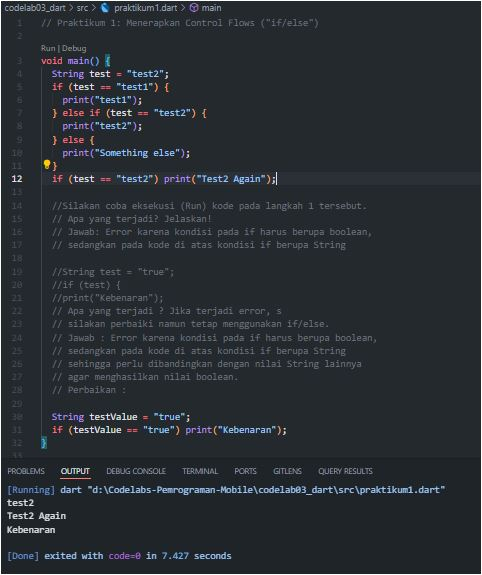
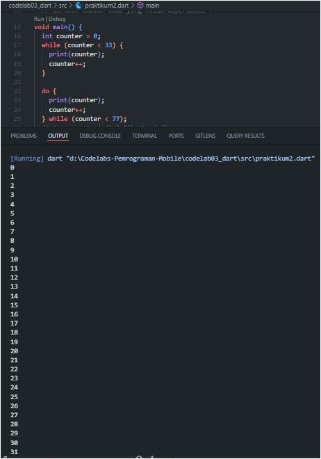
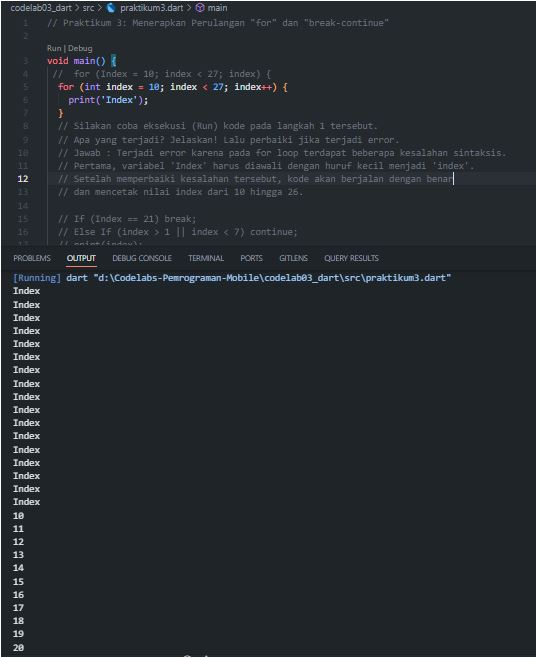
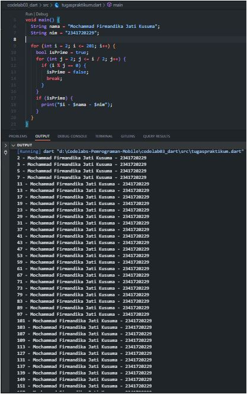

# Laporan Praktikum 
# 03 | Pengantar Bahasa Pemrograman Dart - Bagian 2 
# Pemrograman Mobile

### Nama    : Mochammad Firmandika Jati Kusuma
### NIM     : 2341720229

---

## 1. Silakan selesaikan Praktikum 1 sampai 3, lalu dokumentasikan berupa screenshot hasil pekerjaan beserta penjelasannya!

### Praktikum 1



#### Pertanyaan & Jawaban

> **1.Pertanyaan:**
> Silakan coba eksekusi (Run) kode pada langkah 1 tersebut. Apa yang terjadi? Jelaskan!
>
> ```dart
> void main() {
> String test = "test2";
> if (test == "test1") {
> print("Test1");
> } else If (test == "test2") {
> print("Test2");
> } Else {
> print("Something else");
> }
> if (test == "test2") print("Test2 again");
> }
> ```
>
> **Jawaban:**
> Terjadi error karena penggunaan `If` dan `Else` harus diawali dengan huruf kecil menjadi `if` dan `else`. Selain itu, kondisi pada `else if` juga perlu diperbaiki. Setelah diperbaiki, kode akan berjalan dengan benar. Kode akan memeriksa nilai variabel `test` dan mencetak "Test2" karena nilai `test` adalah "test2" yang sesuai dengan kondisi pada `else if`.
>
> Berikut adalah kode yang telah diperbaiki:
>
> ```dart
> void main() {
> String test = "test2";
> if (test == "test1") {
> print("Test1");
> } else if (test == "test2") {
> print("Test2");
> } else {
> print("Something else");
> }
> if (test == "test2") {
> print("Test2 again");
> }
> ```
>
> ---
>
> **2.Pertanyaan:**
> Apa yang terjadi? Jika terjadi error, silakan perbaiki namun tetap menggunakan `if/else`.
>
> ```dart
> String test = "true";
> if (test) {
> print("Kebenaran");
> }
> ```
>
> **Jawaban:**
> Terjadi error karena kondisi pada `if` harus berupa nilai boolean (`true` atau `false`), sedangkan pada kode di atas kondisinya adalah sebuah `String`. Untuk memperbaikinya, `String` harus dibandingkan dengan nilai lain agar menghasilkan nilai boolean.
>
> **Perbaikan:**
>
> ```dart
> String testValue = "true";
> if (testValue == "true") {
> print("Kebenaran");
> }
> ```

---

### Praktikum 2



#### Pertanyaan & Jawaban

> **1.Pertanyaan:**
> Silakan coba eksekusi (Run) kode pada langkah 1 tersebut. Apa yang terjadi? Jelaskan! Lalu perbaiki jika terjadi error.
>
> ```dart
> void main() {
> while (counter < 33) {
> print(counter);
> counter++;
> }
> }
> ```
>
> **Jawaban:**
> Terjadi error karena variabel `counter` belum dideklarasikan (diberi tipe data dan nilai awal) sebelum digunakan.
>
> Berikut adalah kode yang telah diperbaiki:
>
> ```dart
> void main() {
> int counter = 0;
> while (counter < 33) {
> print(counter);
> counter++;
> }
> }
> ```
>
> ---
>
> **2.Pertanyaan:**
> Apa yang terjadi? Jika terjadi error, silakan perbaiki namun tetap menggunakan `do-while`.
>
> ```dart
> do {
> print(counter);
> counter++;
> } while (counter < 77);
> ```
>
> **Jawaban:**
> Kode berjalan dengan mencetak nilai `counter` dari 33 sampai 76. Hal ini terjadi karena kondisi pada `do-while` terpenuhi (`counter < 77`). Perulangan akan terus dieksekusi selama kondisi terpenuhi. Ketika `counter` mencapai 77, kondisi menjadi `false` dan perulangan berhenti.

---

### Praktikum 3



#### Pertanyaan & Jawaban

> **1.Pertanyaan:**
> Silakan coba eksekusi (Run) kode pada langkah 1 tersebut. Apa yang terjadi? Jelaskan! Lalu perbaiki jika terjadi error.
>
> ```dart
> void main() {
> for (Index = 10; index < 27; index) {
> print(Index);
> }
> }
> ```
>
> **Jawaban:**
> Terjadi error karena variabel `Index` belum dideklarasikan dan penulisan `Index` tidak konsisten. Perlu diganti menjadi `index` pada semua bagiannya dan dideklarasikan dengan tipe data `int`. Selain itu, pada bagian increment perlu ditambahkan operator `++` untuk menambah nilai `index` setiap iterasi, dan `print('Index')` harus diganti menjadi `print(index)`. Setelah diperbaiki, kode akan mencetak angka dari 10 hingga 26.
>
> Berikut adalah kode yang telah diperbaiki:
>
> ```dart
> void main() {
> for (int index = 10; index < 27; index++) {
> print(index);
> }
> }
> ```
>
> ---
>
> **2.Pertanyaan:**
> Apa yang terjadi? Jika terjadi error, silakan perbaiki namun tetap menggunakan `for` dan `break-continue`.
>
> ```dart
> If (Index == 21) break;
> Else If (index > 1 || index < 7) continue;
> print(index);
> ```
>
> **Jawaban:**
> Terjadi error karena penggunaan `If` dan `Else If` harus diawali dengan huruf kecil menjadi `if` dan `else if`. Setelah diperbaiki, kode akan berjalan dengan mencetak nilai dari 0 hingga 24. Perulangan akan berhenti ketika `index` mencapai 21 (karena `break`) dan akan melewati nilai `index` antara 2 hingga 6 (karena `continue`).
>
> Berikut adalah kode yang telah diperbaiki:
>
> ```dart
> for (int index = 0; index < 27; index++) {
> if (index == 21) {
> break;
> }
> if (index > 1 && index < 7) {
> continue;
> }
> print(index);
> }
> ```

---

## 2. Buatlah sebuah program yang dapat menampilkan bilangan prima dari angka 0 sampai 201 menggunakan Dart. 
Ketika bilangan prima ditemukan, maka tampilkan nama lengkap dan NIM Anda. (tugaspratikum.dart)



**Kode Program:**

```dart
void main() {
  String nama = "Nama Lengkap Anda";
  String nim = "NIM Anda";

  print("Program Bilangan Prima dari 0 sampai 201");
  print("---");

  for (int i = 2; i <= 201; i++) {
    bool isPrime = true;
    for (int j = 2; j <= i / 2; j++) {
      if (i % j == 0) {
        isPrime = false;
        break;
      }
    }
    if (isPrime) {
      print("$i - $nama - $nim");
    }
  }
}

---

## 3. Kumpulkan berupa link commit repo GitHub pada tautan yang telah disediakan di grup Telegram! (tugaspratikum.dart)