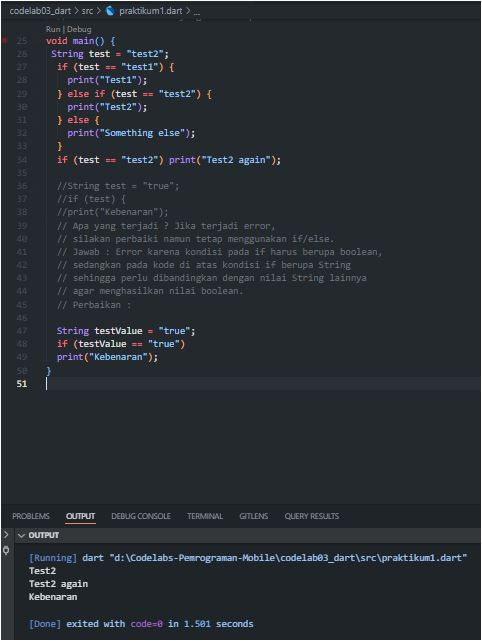
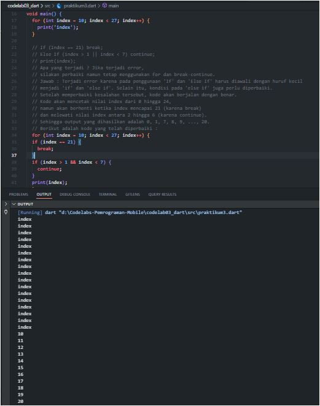

## 5. Tugas Praktikum

### 1. Silakan selesaikan Praktikum 1 sampai 3, lalu dokumentasikan berupa screenshot hasil pekerjaan beserta penjelasannya!
### Jawab :
#### Praktikum 1

_Pertanyaan mengenai Praktikum 1_
void main() {
String test = "test2";
if (test == "test1") {
print("Test1");
} else If (test == "test2") {
print("Test2");
} Else {
print("Something else");
}

if (test == "test2") print("Test2 again");
}
1. Silakan coba eksekusi (Run) kode pada langkah 1 tersebut. Apa yang terjadi? Jelaskan!
   Jawab : Terjadi error karena pada penggunaan 'If' dan 'Else' harus diawali dengan huruf kecil menjadi 'if' dan 'else'.
   Selain itu, kondisi pada 'else if' juga perlu diperbaiki. Setelah memperbaiki kesalahan tersebut, kode akan berjalan dengan benar.
   Kode akan memeriksa nilai variabel 'test' dan mencetak "Test2" karena nilai 'test' adalah "test2" yang sesuai dengan kondisi pada 'else if'.
   Jika nilai 'test' tidak sesuai dengan kondisi manapun, maka blok kode pada 'else' akan dieksekusi dan mencetak "Something else".
   Berikut adalah kode yang telah diperbaiki :
void main() {
String test = "test2";
if (test == "test1") {
print("Test1");
} else if (test == "test2") {
print("Test2");
} else {
print("Something else");
}
if (test == "test2") print("Test2 again");
}

String test = "true";
if (test) {
print("Kebenaran");
2. Apa yang terjadi ? Jika terjadi error, silakan perbaiki namun tetap menggunakan if/else.
   Jawab : Error karena kondisi pada if harus berupa boolean, sedangkan pada kode di atas kondisi if berupa String
   sehingga perlu dibandingkan dengan nilai String lainnya agar menghasilkan nilai boolean.
   Perbaikan :
String testValue = "true";
if (testValue == "true") 
print("Kebenaran");
}

#### Praktikum 2

_Pertanyaan mengenai Praktikum 2_
void main() {
while (counter < 33) {
print(counter);
counter++;
}
}
1. Silakan coba eksekusi (Run) kode pada langkah 1 tersebut. Apa yang terjadi? Jelaskan! Lalu perbaiki jika terjadi error.
   Jawab : Terjadi error karena variabel 'counter' belum dideklarasikan sebelum digunakan.
   Setelah memperbaiki kesalahan tersebut, kode akan berjalan dengan benar dan mencetak nilai counter dari 0 hingga 32.
   Berikut adalah kode yang telah diperbaiki :
void main() {
int counter = 0;
while (counter < 33) {
print(counter);
counter++;
}
}

do {
print(counter);
counter++;
} while (counter < 77); 
2. Apa yang terjadi ? Jika terjadi error, silakan perbaiki namun tetap menggunakan do-while.
   Jawab : Kode berjalan dengan mencetak nilai counter dari 33 sampai 76, karena kondisi pada do-while terpenuhi selama counter < 77
   sehingga selama kondisi terpenuhi, blok kode di dalam do-while akan terus dieksekusi.
   Setelah counter mencapai 77, kondisi pada do-while menjadi false sehingga perulangan berhenti.

#### Praktikum 3

_Pertanyaan mengenai Praktikum 3_
void main() {
for (Index = 10; index < 27; index) {  
 print(Index);
}
}
1. Silakan coba eksekusi (Run) kode pada langkah 1 tersebut. Apa yang terjadi? Jelaskan! Lalu perbaiki jika terjadi error.
   Jawab : Terjadi error karena variabel 'Index' belum dideklarasikan sebelum digunakan dan penulisan 'Index' harus konsisten (besar/kecil).
   Sehingga perlu diganti menjadi 'index' pada semua bagiannya agar konsisten dan dideklarasikan dengan tipe data 'int'.
   Selain itu, pada bagian increment perlu ditambahkan operator '++' untuk menambah nilai index setiap iterasi.
   print('Index'); juga perlu diganti menjadi print(index); agar sesuai dengan nama variabel yang telah dideklarasikan.
   Setelah memperbaiki kesalahan tersebut, kode akan berjalan dengan benar dan mencetak nilai index dari 10 hingga 26.
   Sehingga output yang dihasilkan adalah 10, 11, 12, ..., 26.
   Berikut adalah kode yang telah diperbaiki :
   void main() {
   for (int index = 10; index < 27; index++) {
   print('index');
   }
   }

If (Index == 21) break;
Else If (index > 1 || index < 7) continue;
print(index); 
2. Apa yang terjadi ? Jika terjadi error, silakan perbaiki namun tetap menggunakan for dan break-continue.
   Jawab : Terjadi error karena pada penggunaan 'If' dan 'Else If' harus diawali dengan huruf kecil
   menjadi 'if' dan 'else if'. Selain itu, kondisi pada 'else if' juga perlu diperbaiki.
   Setelah memperbaiki kesalahan tersebut, kode akan berjalan dengan benar. Kode akan mencetak nilai index dari 0 hingga 24,
   namun akan berhenti ketika index mencapai 21 (karena break) dan melewati nilai index antara 2 hingga 6 (karena continue).
   Sehingga output yang dihasilkan adalah 0, 1, 7, 8, 9, ..., 20.
   Berikut adalah kode yang telah diperbaiki :
for (int index = 10; index < 27; index++) {
if (index == 21) {
break;
}
if (index > 1 && index < 7) {
continue;
}
print(index);
}

### 2. Buatlah sebuah program yang dapat menampilkan bilangan prima dari angka 0 sampai 201 menggunakan Dart.
### Ketika bilangan prima ditemukan, maka tampilkan nama lengkap dan NIM Anda. (tugaspratikum.dart)
### Jawab :

Berikut adalah kode yang digunakan :
void main() {
String nama = "Nama Lengkap Anda";
String nim = "NIM Anda";

print("Program Bilangan Prima dari 0 sampai 201");
print("---");

for (int i = 2; i <= 201; i++) {
bool isPrime = true;
for (int j = 2; j <= i / 2; j++) {
if (i % j == 0) {
isPrime = false;
break;
}
}
if (isPrime) {
print("$i - $nama - $nim");
}
}
}

### 3. Kumpulkan berupa link commit repo GitHub pada tautan yang telah disediakan di grup Telegram!
### Jawab: 