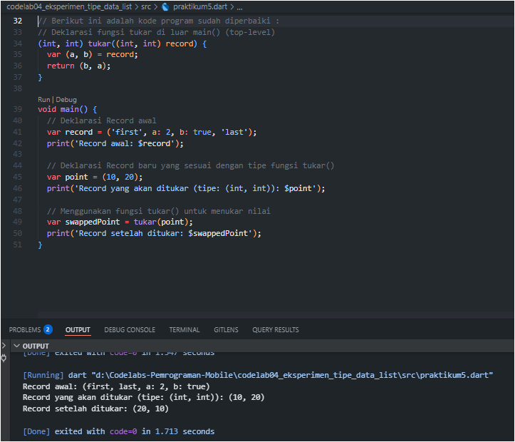

# Laporan Praktikum

# 04 | Pengantar Bahasa Pemrograman Dart - Bagian 3

# Pemrograman Mobile

### Nama : Mochammad Firmandika Jati Kusuma

### NIM : 2341720229

---
7. Tugas Praktikum

** 1. Silakan selesaikan Praktikum 1 sampai 5, lalu dokumentasikan berupa screenshot hasil pekerjaan Anda beserta penjelasannya!
   
   Jawab :
   ## 1. Praktikum 1 : Eksperimen Tipe Data List

### Langkah 1 & 2
* **Kode Program :**
    ```dart
    void main() {
      var list = [1, 2, 3];
      assert(list.length == 3);
      assert(list[1] == 2);
      print(list.length);
      print(list[1]);
    
      list[1] = 1;
      assert(list[1] == 1);
      print(list[1]);
    }
    ```
* **Apa yang terjadi ? Jelaskan!**
    
    Kode berhasil dieksekusi tanpa eror. Kode ini membuat list dengan tiga elemen, memeriksa panjangnya, lalu mengubah nilai pada indeks ke-1. Hasilnya menunjukkan panjang list tetap 3, dan nilai pada indeks ke-1 berubah dari 2 menjadi 1.
* **Screenshot Hasil :**
    

### Langkah 3
* **Kode Program :**
    ```dart
    void main() {
      final list = List<dynamic>.filled(5, null);
      list[1] = 'Mochammad Firmandika Jati Kusuma';
      list[2] = '2341720229';
      
      print('List awal:');
      print(list);
    
      print('\nElemen pada indeks ke-1: ${list[1]}');
      print('Elemen pada indeks ke-2: ${list[2]}');
      print('Panjang list: ${list.length}');
    }
    ```
* **Apa yang terjadi? Jika terjadi eror, silakan perbaiki!**
    
    Terjadi eror pada kode awal karena mencoba mengisi elemen pada indeks yang tidak ada. Perbaikan dilakukan dengan membuat list berukuran 5 (`List.filled(5, null)`), yang menciptakan "slot" kosong yang bisa diisi.
* **Screenshot Hasil :**
    

---

## 2. Praktikum 2 : Eksperimen Tipe Data Set

### Langkah 1 & 2
* **Kode Program :**
    ```dart
    void main() {
      var halogens = {'fluorine', 'chlorine', 'bromine', 'iodine', 'astatine'};
      print(halogens);
    }
    ```
* **Apa yang terjadi? Jelaskan! Lalu perbaiki jika terjadi eror.**
  
    Kode berhasil dieksekusi tanpa eror. Kode ini membuat dan mencetak sebuah `Set` yang berisi lima elemen unik.
* **Screenshot Hasil :**
    

### Langkah 3
* **Kode Program Awal :**
    ```dart
    void main() {
      var halogens = {'fluorine', 'chlorine', 'bromine', 'iodine', 'astatine'};
      print(halogens);
      var names1 = <String>{};
      Set<String> names2 = {};
      var names3 = {}; 
      print(names1);
      print(names2);
      print(names3);
    }
    ```
* **Apa yang terjadi? Jika terjadi eror, silakan perbaiki!**
  
    Tidak ada eror. Namun, `names3` bukanlah `Set` melainkan `Map` kosong. Kode di bawah ini menambahkan elemen ke `Set` `names1` (`.add()`) dan `names2` (`.addAll()`).
* **Kode Program yang Diperbaiki dan Ditambahkan :**
    ```dart
    void main() {
      var halogens = {'fluorine', 'chlorine', 'bromine', 'iodine', 'astatine'};
      print('Halogen: $halogens');
    
      var names1 = <String>{};
      Set<String> names2 = {};
    
      names1.add('Mochammad Firmandika Jati Kusuma');
      names1.add('2341720229');
    
      names2.addAll({'Mochammad Firmandika Jati Kusuma', '2341720229'});
    
      print('Isi names1 (menggunakan .add()): $names1');
      print('Isi names2 (menggunakan .addAll()): $names2');
    }
    ```
* **Screenshot Hasil :**
    

    

---

## 3. Praktikum 3 : Eksperimen Tipe Data Maps

### Langkah 1 & 2
* **Kode Program :**
    ```dart
    void main() {
      var gifts = {
        'first': 'partridge',
        'second': 'turtledoves',
        'fifth': 1
      };
      var nobleGases = {
        2: 'helium',
        10: 'neon',
        18: 2,
      };
      print(gifts);
      print(nobleGases);
    }
    ```
* **Apa yang terjadi? Jelaskan! Lalu perbaiki jika terjadi eror.**
  
    Kode berjalan tanpa eror. Dua `Map` (`gifts` dan `nobleGases`) dengan tipe *key-value* yang berbeda berhasil dibuat dan dicetak.
* **Screenshot Hasil :**
    

### Langkah 3
* **Kode Program Awal :**
    ```dart
    void main() {
      var gifts = { /* ... */ };
      var nobleGases = { /* ... */ };
      var mhs1 = Map<String, String>();
      // ...kode pembaruan gifts...
      var mhs2 = Map<int, String>();
      // ...kode pembaruan nobleGases...
      print('gifts: $gifts');
      print('nobleGases: $nobleGases');
      print('mhs1: $mhs1');
      print('mhs2: $mhs2');
    }
    ```
* **Apa yang terjadi? Jika terjadi eror, silakan perbaiki.**
  
    Kode awal berhasil dieksekusi, tetapi `mhs1` dan `mhs2` kosong. Kode di bawah ini mengisi semua `Map` (`gifts`, `nobleGases`, `mhs1`, `mhs2`) dengan data nama dan NIM.
* **Kode Program yang Diperbaiki dan Ditambahkan :**
    ```dart
    void main() {
      var gifts = {'first': 'partridge', 'second': 'turtledoves', 'fifth': 1};
      var nobleGases = {2: 'helium', 10: 'neon', 18: 2};
      gifts['Nama'] = 'Mochammad Firmandika Jati Kusuma';
      gifts['NIM'] = '2341720229';
      nobleGases[20] = 'Mochammad Firmandika Jati Kusuma';
      nobleGases[21] = '2341720229';
      var mhs1 = <String, String>{};
      mhs1['NIM'] = 'Mochammad Firmandika Jati Kusuma';
      mhs1['Nama'] = '2341720229';
      var mhs2 = <int, String>{};
      mhs2[1] = 'Mochammad Firmandika Jati Kusuma';
      mhs2[2] = '2341720229';
      print('gifts: $gifts');
      print('nobleGases: $nobleGases');
      print('mhs1: $mhs1');
      print('mhs2: $mhs2');
    }
    ```
* **Screenshot Hasil :**
    

    

---

## 4. Praktikum 4 : Eksperimen Tipe Data List: Spread & Control-flow Operators

### Langkah 1 & 2
* **Kode Program :**
    ```dart
    void main() {
      var list1 = [1, 2, 3];
      var list2 = [0, ...list1];
      print(list1);
      print(list2);
      print(list2.length);
    }
    ```
* **Apa yang terjadi? Jelaskan! Lalu perbaiki jika terjadi eror.**
  
    Kode awal menghasilkan eror karena `list1` digunakan sebelum didefinisikan. Setelah diperbaiki, kode berjalan lancar dan `...` (Spread Operator) menyisipkan semua elemen `list1` ke `list2`.
* **Screenshot Hasil :**
    

### Langkah 3
* **Kode Program Awal :**
    ```dart
    void main() {
      var list1 = [1, 2, 3];
      list1 = [1, 2, null];
      var list2 = [0, ...list1];
      var list3 = [0, ...?list1];
      print(list1);
      print(list2);
      print(list2.length);
      print(list3.length);
    }
    ```
* **Apa yang terjadi? Jika terjadi eror, silakan perbaiki.**
  
    Eror terjadi karena `list1` (bertipe `int`) tidak bisa menampung `null`. Solusinya adalah mendeklarasikan `list1` sebagai `List<int?>`.
* **Kode Program yang Diperbaiki :**
    ```dart
    void main() {
      var list1 = <int?>[1, 2, 3];
      list1 = [1, 2, null];
      var list2 = [0, ...list1];
      var list3 = [0, ...?list1];
      print(list1);
      print(list2);
      print(list2.length);
      print(list3);
      print(list3.length);
    }
    ```
* **Screenshot Hasil :**
    

### Langkah 4
* **Kode Program Awal :**
    ```dart
    void main() {
      //...kode sebelumnya...
      var nav = ['Home', 'Furniture', 'Plants', if (promoActive)];
      print(nav);
    }
    ```
* **Apa yang terjadi? Jika terjadi eror, silakan perbaiki. Tunjukkan hasilnya jika variabel promoActive ketika true dan false.**
  
    Eror terjadi karena `promoActive` tidak dideklarasikan. Perbaikan dilakukan dengan mendeklarasikan `promoActive` dan menambahkan elemen `'Outlet'` di dalam `if`.
* **Kode Program yang Diperbaiki dan Ditambahkan :**
    ```dart
    void main() {
      //...kode sebelumnya...
      var promoActive = true;
      var navTrue = ['Home', 'Furniture', 'Plants', if (promoActive) 'Outlet'];
      print('Hasil ketika promoActive = true:');
      print('nav: $navTrue');
      
      promoActive = false;
      var navFalse = ['Home', 'Furniture', 'Plants', if (promoActive) 'Outlet'];
      print('\nHasil ketika promoActive = false:');
      print('nav: $navFalse');
    }
    ```
* **Screenshot Hasil :**
    

### Langkah 5
* **Kode Program Awal :**
    ```dart
    void main() {
      //...kode sebelumnya...
      var nav2 = ['Home', 'Furniture', 'Plants', if (login case 'Manager') 'Inventory'];
      print(nav2);
    }
    ```
* **Apa yang terjadi? Jika terjadi eror, silakan perbaiki. Tunjukkan hasilnya jika variabel login mempunyai kondisi lain.**
  
    Eror karena `if (login case ...)` adalah sintaks yang salah. Perbaikan dilakukan dengan menggunakan `if (login == '...')`.
* **Kode Program yang Diperbaiki dan Ditambahkan :**
    ```dart
    void main() {
      //...kode sebelumnya...
      var login = 'Manager';
      var navManager = ['Home', 'Furniture', 'Plants', if (login == 'Manager') 'Inventory'];
      print('Navigasi ketika login sebagai Manager: $navManager');
      
      login = 'Admin';
      var navAdmin = ['Home', 'Furniture', 'Plants', if (login == 'Manager') 'Inventory'];
      print('Navigasi ketika login sebagai Admin: $navAdmin');
    }
    ```
* **Screenshot Hasil :**
    

### Langkah 6
* **Kode Program :**
    ```dart
    void main() {
      //...kode sebelumnya...
      var listOfInts = [1, 2, 3];
      var listOfStrings = ['#0', for (var i in listOfInts) '#$i'];
      assert(listOfStrings[1] == '#1');
      print(listOfStrings);
    }
    ```
* **Apa yang terjadi? Jika terjadi eror, silakan perbaiki. Jelaskan manfaat Collection For dan dokumentasikan hasilnya.**
  
    Tidak ada eror. `Collection for` adalah cara ringkas untuk membangun `list` dari `list` lain. Kode menjadi lebih rapi dan mudah dibaca.
* **Screenshot Hasil :**
    

---

## 5. Praktikum 5 : Eksperimen Tipe Data Records

### Langkah 1 & 2
* **Kode Program :**
    ```dart
    void main() {
      var record = ('first', a: 2, b: true, 'last');
      print(record);
    }
    ```
* **Apa yang terjadi? Jelaskan! Lalu perbaiki jika terjadi eror.**
  
    Kode mengalami eror karena tidak ada tanda `;` pada `print(record)`. Setelah ditambahkan, kode berhasil dieksekusi.
* **Screenshot Hasil :**
    

### Langkah 3
* **Kode Program :**
    ```dart
    (int, int) tukar((int, int) record) { ... }
    void main() {
      var record = ('first', a: 2, b: true, 'last');
      print(record);
    }
    ```
* **Apa yang terjadi? Jika terjadi eror, silakan perbaiki.**
  
    Eror terjadi karena `Record` yang dideklarasikan tidak cocok dengan tipe yang diharapkan oleh fungsi `tukar()`. Perbaikan dilakukan dengan membuat `Record` baru dengan tipe yang sesuai.
* **Screenshot Hasil :**
    

### Langkah 4
* **Kode Program Awal :**
    ```dart
    void main() {
      //...kode sebelumnya...
      (String, int) mahasiswa;
      print(mahasiswa);
    }
    ```
* **Apa yang terjadi? Jika terjadi eror, silakan perbaiki.**
  
    Eror karena variabel `mahasiswa` hanya dideklarasikan tanpa diinisialisasi. Perbaikan dilakukan dengan memberikan nilai awal.
* **Kode Program yang Diperbaiki :**
    ```dart
    void main() {
      //...kode sebelumnya...
      (String, int) mahasiswa = ('Mochammad Firmandika Jati Kusuma', 2341720229);
      print('Data Mahasiswa: $mahasiswa');
    }
    ```
* **Screenshot Hasil :**
    

### Langkah 5
* **Kode Program Awal :**
    ```dart
    void main() {
      //...kode sebelumnya...
      var mahasiswa2 = ('first', a:2, b:true, 'last');
      print(mahasiswa2.$1);
      print(mahasiswa2.a);
      print(mahasiswa2.b);
      print(mahasiswa2.$2);
    }
    ```
* **Apa yang terjadi? Jika terjadi eror, silakan perbaiki. Gantilah salah satu isi record dengan nama dan NIM Anda, lalu dokumentasikan hasilnya dan buat laporannya!**
  
    Tidak ada eror, namun outputnya tidak sesuai ekspektasi. Perbaikan dilakukan dengan mengganti nilai `a` dan `b` pada `mahasiswa2`.
* **Kode Program yang Diperbaiki :**
    ```dart
    void main() {
      //...kode sebelumnya...
      var mahasiswa2 = ('first', a:2341720229, b:'Mochammad Firmandika Jati Kusuma', 'last');
      print('Record setelah diubah: $mahasiswa2');
      print('Mengakses elemen:');
      print('Elemen ke-1: ${mahasiswa2.$1}');
      print('Elemen bernama "a": ${mahasiswa2.a}');
      print('Elemen bernama "b": ${mahasiswa2.b}');
      print('Elemen ke-4: ${mahasiswa2.$4}'); // Perbaikan
    }
    ```
* **Screenshot Hasil :**
    

2. Jelaskan yang dimaksud Functions dalam bahasa Dart!
    
    Jawab : Functions dalam bahasa Dart adalah blok kode yang dapat digunakan kembali untuk melakukan tugas tertentu. Functions membantu mengorganisasi kode agar lebih rapi, mudah dibaca, dan modular. Sehingga bisa menerima masukan melalui parameter dan menghasilkan keluaran melalui return value. 

3. Jelaskan jenis-jenis parameter di Functions beserta contoh
   sintaksnya!
    
    Jawab : Dart memiliki tiga jenis parameter utama yang memberikan fleksibilitas saat memanggil fungsi :

   1. **Positional Parameters (Parameter Posisional)** : Parameter yang harus diisi dan urutannya harus sesuai dengan urutan deklarasi. Mereka adalah jenis parameter yang paling umum.

    ```dart
    String sayHello(String name, int age) {
      return 'Halo $name, kamu berumur $age tahun.';
    }

    void main() {
      sayHello('Budi', 20);
    }
    ```
   2. **Optional Positional Parameters** : Ditandai dengan `[]`, parameter ini tidak wajib diisi.

    ```dart
    String sayHello(String name, [String? greeting]) {
      return greeting ?? 'Halo' + ' ' + name;
    }
    sayHello('Ani'); // greeting tidak diisi
    sayHello('Budi', 'Halo'); // greeting diisi
    ```

   3. **Named Parameters** : Ditandai dengan `{}`, parameter ini memiliki nama dan urutannya tidak penting. Gunakan `required` untuk membuatnya wajib diisi.

    ```dart
    String sayHello({required String name, int? age}) {
      return 'Halo $name' + (age != null ? ', kamu berumur $age tahun.' : '');
    }
    sayHello(age: 25, name: 'Citra'); // Urutan tidak masalah
    ```

---

4. Jelaskan maksud Functions sebagai first-class objects beserta contoh
   sintaknya!

    Jawab : Dalam Dart, fungsi adalah first-class objects, yang berarti  dapat diperlakukan seperti variabel biasa. Ini membuat fleksibilitas tinggi dalam pemrograman, karena fungsi bisa disimpan di dalam variabel, diteruskan sebagai argumen ke fungsi lain, atau bahkan dikembalikan sebagai nilai dari fungsi lain. Kemampuan ini memungkinkan kode menjadi lebih dinamis dan modular.

    **Contoh :**
    
    ```dart
    // Fungsi disimpan dalam variabel
    var perkalian = (int a, int b) => a * b;
    print(perkalian(5, 3)); // Output: 15

    // Fungsi diteruskan sebagai argumen
    void cetak(Function func, int a, int b) {
    print(func(a, b));
    }
    cetak(perkalian, 5, 3); 
    // Output : 15,15
    ```
---

  5. Apa itu Anonymous Functions? Jelaskan dan berikan contohnya!

       Jawab : Anonymous Functions adalah fungsi tanpa nama. Hal itu sering digunakan untuk tugas-tugas singkat, seperti sebagai argumen untuk metode seperti forEach() atau map().

        **Contoh :**

        ```dart
        var list = ['Apel', 'Jeruk', 'Mangga'];
        list.forEach((item) { // (item) { ... } adalah anonymous function
        print('${list.indexOf(item)}: $item');
        }); 
        // Output :
        // 0: Apel
        // 1: Jeruk
        // 2: Mangga
        ```
        
---

   6. Jelaskan perbedaan Lexical scope dan Lexical closures! Berikan contohnya!
      
      Jawab : 
- Lexical Scope : Mengacu pada cara variabel diatur dan diakses dalam kode. Variabel yang dideklarasikan di luar fungsi (global) dapat diakses di dalam fungsi, tetapi tidak sebaliknya. Lingkupnya ditentukan saat kode ditulis (secara leksikal).
- Lexical Closures : Terjadi ketika sebuah fungsi dapat mengakses variabel dari lingkup luarnya, bahkan setelah lingkup luar tersebut selesai dieksekusi. Fungsi tersebut "menutup" (closure) variabel-variabel tersebut.

     **Contoh :**

    ```dart
    Function buatPenambah(int tambahan) {
    // Ini adalah closure. Fungsi yang dikembalikan
    // "mengingat" variabel 'tambahan'.
    return (int i) => i + tambahan;
    }

    void main() {
    var tambahLima = buatPenambah(5); // tambahLima adalah closure
    print(tambahLima(10)); // Output: 15. 'tambahan' (5) tetap bisa diakses.
    }
    ```
---

7. Jelaskan dengan contoh cara membuat return multiple value di Functions!

    Jawab : Dalam bahasa Dart, cara ini dapat mengembalikan beberapa nilai dari sebuah fungsi menggunakan Records. Hal ini memungkinkan mengemas beberapa nilai menjadi satu objek tunggal untuk dikembalikan.

     **Contoh :**

    ```dart

    (String, int) ambilDataMahasiswa() {
    // Mengembalikan dua nilai berbeda dalam satu Record
    var nama = 'Mochammad Firmandika Jati Kusuma';
    var nim = 2341720229;
    return (nama, nim);
    }

    void main() {
    var (namaMahasiswa, nimMahasiswa) = ambilDataMahasiswa();
    print('Nama: $namaMahasiswa');
    print('NIM: $nimMahasiswa');
    }
    ```