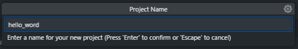
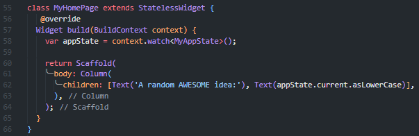

# Laporan Praktikum

# 05 | Aplikasi Pertama dan Widget Dasar Flutter

# Pemrograman Mobile

### Nama : Mochammad Firmandika Jati Kusuma

### NIM : 2341720229

---

## Praktikum 1: Membuat Project Flutter Baru

### Langkah 1 :

Buka VS Code, lalu tekan tombol Ctrl + Shift + P maka akan tampil Command Palette, lalu ketik Flutter. Pilih New Application Project.

### Langkah 2 :

Kemudian buat folder sesuai style laporan praktikum yang Anda pilih. Disarankan pada folder dokumen atau desktop atau alamat folder lain yang tidak terlalu dalam atau panjang. Lalu pilih Select a folder to create the project in.

### Langkah 3 :

Buat nama project flutter hello_world seperti berikut, lalu tekan Enter. Tunggu hingga proses pembuatan project baru selesai.

### Langkah 4 :
Jika sudah selesai proses pembuatan project baru, pastikan tampilan seperti berikut. Pesan akan tampil berupa "Your Flutter Project is ready!" artinya Anda telah berhasil membuat project Flutter baru.

## Praktikum 2 : Menghubungkan Perangkat Android atau Emulator

Melanjutkan dari praktikum 1, Anda diminta untuk menjalankan aplikasi ke perangkat fisik (device Android atau iOS). Silakan ikuti langkah-langkah pada codelab tautan berikut ini.

https://developer.android.com/codelabs/basic-android-kotlin-compose-connect-device?hl=id#0

## • Mengaktifkan proses debug USB

Agar Android Studio dapat berkomunikasi dengan perangkat Android, Anda harus mengaktifkan proses debug USB di setelan Opsi developer di perangkat.

Untuk menampilkan opsi developer dan mengaktifkan Proses debug USB :

1.	Di perangkat Android, ketuk Settings > About phone.
2.	Ketuk Build number tujuh kali.
3.	Jika diminta, masukkan sandi atau PIN perangkat. Anda tahu Anda telah berhasil saat melihat pesan You are now a developer!.

    

4.	Kembali ke Settings, lalu ketuk System > Developer options.
5.	Jika Anda tidak melihat Developer options, ketuk Advanced options.
          
    

    .jpeg)

6.	Ketuk Opsi developer, lalu ketuk tombol Proses debug USB untuk mengaktifkannya.
 
    .jpeg)

    

•	Menginstal Driver USB Google (khusus Windows)
Jika Android Studio diinstal di Windows, Anda harus menginstal driver perangkat USB agar dapat menjalankan aplikasi di perangkat fisik.

1.	Di Android Studio, klik Tools > SDK Manager. Dialog Preferences > Appearance & Behavior > System Settings > Android SDK akan terbuka.
2.	Klik tab SDK Tools.
3.	Pilih Google USB Driver, lalu klik OK.

    .png)
 
Setelah selesai, file driver akan didownload ke direktori android_sdk\extras\google\usb_driver. Sekarang Anda dapat menghubungkan dan menjalankan aplikasi dari Android Studio.

## • Menjalankan aplikasi di perangkat Android menggunakan kabel
Adua cara untuk menghubungkan perangkat ke Android Studio, melalui kabel atau Wi-Fi. Anda dapat memilih cara mana pun yang Anda sukai.

Untuk menjalankan aplikasi dari Android Studio di perangkat Android:
1.	Sambungkan perangkat Android ke komputer menggunakan kabel USB. Dialog yang meminta Anda mengizinkan proses debug USB akan muncul di perangkat.
2.	Pilih kotak centang Always allow from this computer, lalu ketuk OK.
3.	Di Android Studio di komputer, pastikan perangkat Anda dipilih di menu dropdown. Klik .
 
    .png)
 
4.	Pilih perangkat lalu klik OK. Android Studio akan menginstal aplikasi di perangkat, lalu menjalankannya.

    .png)

5. Jika perangkat menjalankan platform Android yang tidak diinstal di Android Studio dan melihat pesan berisi pertanyaan apakah Anda ingin menginstal platform yang diperlukan, klik Install > Continue > Finish. Android Studio akan menginstal aplikasi di perangkat, lalu menjalankannya.

## • Menjalankan aplikasi di perangkat Android menggunakan Wi-Fi
Jika tidak memiliki kabel, Anda juga dapat menghubungkan dan menjalankan aplikasi di perangkat dengan Wi-Fi.

Mulai
1.	Pastikan komputer dan perangkat Anda terhubung ke jaringan nirkabel yang sama.
2.	Pastikan perangkat Anda menjalankan Android 11 atau yang lebih baru. Untuk informasi selengkapnya, lihat Memeriksa & mengupdate versi Android.
3.	Pastikan komputer Anda telah memiliki Android Studio versi terbaru. Untuk mendownloadnya, lihat Android Studio.
4.	Pastikan komputer Anda memiliki SDK Platform Tools versi terbaru.

## Menyambungkan perangkat Anda
1.	Di Android Studio, pilih Pair Devices Using Wi-Fi dari menu drop-down konfigurasi run.
 
    .png)

    Dialog Pair devices over Wi-Fi akan terbuka.

    .png)

2.	Buka Developer options, scroll ke bawah ke bagian Debugging, lalu aktifkan Wireless debugging.
      
     .jpeg)

3.	Pada pop-up Izinkan proses debug nirkabel di jaringan ini?, pilih Allow.
 
    .jpeg)

4.	Jika Anda ingin menyambungkan perangkat dengan kode QR, pilih Pair device with QR code, lalu pindai kode QR di komputer Anda. Atau, jika Anda ingin menyambungkan perangkat dengan kode penghubung, pilih Pair device with pairing code, lalu masukkan 6 digit kode.
5.	Klik jalankan dan Anda dapat men-deploy aplikasi ke perangkat.
 
##	Praktikum 3: Membuat Repository GitHub dan Laporan Praktikum

### Langkah 1 :
Login ke akun GitHub Anda, lalu buat repository baru dengan nama "flutter-fundamental-part1"

### Langkah 2:
Lalu klik tombol "Create repository" lalu akan tampil seperti gambar berikut.

### Langkah 3:
Kembali ke VS code, project flutter hello_world, buka terminal pada menu Terminal > New Terminal. Lalu ketik perintah berikut untuk inisialisasi git pada project Anda.

git init

### Langkah 4:
Pilih menu Source Control di bagian kiri, lalu lakukan stages (+) pada file .gitignore untuk mengunggah file pertama ke repository GitHub.

### Langkah 5:
Beri pesan commit "tambah gitignore" lalu klik Commit (✔)

### Langkah 6:
Lakukan push dengan klik bagian menu titik tiga > Push

### Langkah 7:
Di pojok kanan bawah akan tampil seperti gambar berikut. Klik "Add Remote"

### Langkah 8:
Salin tautan repository Anda dari browser ke bagian ini, lalu klik Add remote

Setelah berhasil, tulis remote name dengan "origin"

### Langkah 9:
Lakukan hal yang sama pada file README.md mulai dari Langkah 4. Setelah berhasil melakukan push, masukkan username GitHub Anda dan password berupa token yang telah dibuat (pengganti password konvensional ketika Anda login di browser GitHub). Reload halaman repository GitHub Anda, maka akan tampil hasil push kedua file tersebut seperti gambar berikut.

### Langkah 10:
Lakukan push juga untuk semua file lainnya dengan pilih Stage All Changes. Beri pesan commit "project hello_world". Maka akan tampil di repository GitHub Anda seperti berikut.

### Langkah 11:
Kembali ke VS Code, ubah platform di pojok kanan bawah ke emulator atau device atau bisa juga menggunakan browser Chrome. Lalu coba running project hello_world dengan tekan F5 atau Run > Start Debugging. Tunggu proses kompilasi hingga selesai, maka aplikasi flutter pertama Anda akan tampil seperti berikut.

### Langkah 12:
Silakan screenshot seperti pada Langkah 11, namun teks yang ditampilkan dalam aplikasi berupa nama lengkap Anda. Simpan file screenshot dengan nama 01.png pada folder images (buat folder baru jika belum ada) di project hello_world Anda. Lalu ubah isi README.md seperti berikut, sehingga tampil hasil screenshot pada file README.md. Kemudian push ke repository Anda.

## Praktikum 4 : Menerapkan Widget Dasar
### Langkah 1 : Text Widget
Buat folder baru basic_widgets di dalam folder lib. Kemudian buat file baru di dalam basic_widgets dengan nama text_widget.dart. Ketik atau salin kode program berikut ke project hello_world Anda pada file text_widget.dart.

Lakukan import file text_widget.dart ke main.dart, lalu ganti bagian text widget dengan kode di atas. Maka hasilnya seperti gambar berikut. Screenshot hasil milik Anda, lalu dibuat laporan pada file README.md.

.png)

### Langkah 2 : Image Widget
Buat sebuah file image_widget.dart di dalam folder basic_widgets dengan isi kode berikut.

Lakukan penyesuaian asset pada file pubspec.yaml dan tambahkan file logo Anda di folder assets project hello_world.

.png)

Jangan lupa sesuaikan kode dan import di file main.dart kemudian akan tampil gambar seperti berikut.

.png)

## Praktikum 5 : Menerapkan Widget Material Design dan iOS Cupertino
Selesaikan langkah-langkah praktikum berikut ini dengan melanjutkan project hello_world Anda. Lakukan langkah yang sama seperti pada Praktikum 3, yaitu setiap widget dibuat file sendiri lalu import ke main.dart dan screenshot hasilnya.

### Langkah 1 : Cupertino Button dan Loading Bar
Buat file di basic_widgets > loading_cupertino.dart. Import stateless widget dari material dan cupertino. Lalu isi kode di dalam method Widget build adalah sebagai berikut.

### Langkah 2: Floating Action Button (FAB)
Button widget terdapat beberapa macam pada flutter yaitu ButtonBar, DropdownButton, TextButton, FloatingActionButton, IconButton, OutlineButton, PopupMenuButton, dan ElevatedButton.

Buat file di basic_widgets > fab_widget.dart. Import stateless widget dari material. Lalu isi kode di dalam method Widget build adalah sebagai berikut.

### Langkah 3: Scaffold Widget
Scaffold widget digunakan untuk mengatur tata letak sesuai dengan material design.

Ubah isi kode main.dart seperti berikut.

### Hasilnya :

.png)

### Langkah 4: Dialog Widget
Dialog widget pada flutter memiliki dua jenis dialog yaitu AlertDialog dan SimpleDialog.

Ubah isi kode main.dart seperti berikut.

### Hasilnya : 

.png)

### Langkah 5: Input dan Selection Widget
Flutter menyediakan widget yang dapat menerima input dari pengguna aplikasi yaitu antara lain Checkbox, Date and Time Pickers, Radio Button, Slider, Switch, TextField.

Contoh penggunaan TextField widget adalah sebagai berikut:

### Hasilnya :

.png)

### Langkah 6: Date and Time Pickers
Date and Time Pickers termasuk pada kategori input dan selection widget, berikut adalah contoh penggunaan Date and Time Pickers.

### Hasilnya :

.png)

.png)

## Tugas Praktikum
1. Selesaikan Praktikum 1 sampai 5, lalu dokumentasikan dan push ke repository Anda berupa screenshot setiap hasil pekerjaan beserta penjelasannya di file README.md!

    Jawab : Dokumentasi dan push ke repository sudah  

2. Selesaikan Praktikum 2 dan Anda wajib menjalankan aplikasi hello_world pada perangkat fisik (device Android/iOS) agar Anda mempunyai pengalaman untuk menghubungkan ke perangkat fisik. Capture hasil aplikasi di perangkat, lalu buatlah laporan praktikum pada file README.md.

    Jawab : Sudah selesai Praktikum 2 bisa dilihat pada Readme.md pada bagian Praktikum 2

    ### Berikut aplikasi hello_word pada perangkat fisik device Android
    

3. Pada praktikum 5 mulai dari Langkah 3 sampai 6, buatlah file widget tersendiri di folder basic_widgets, kemudian pada file main.dart cukup melakukan import widget sesuai masing-masing langkah tersebut!

    Jawab : Sudah selesai Praktikum 5 bisa dilihat pada Readme.md pada bagian Praktikum 5

4. Selesaikan Codelabs: Your first Flutter app, lalu buatlah laporan praktikumnya dan push ke repository GitHub Anda!

    Jawab :

## Your first Flutter app
### 1. Create a project
#### Create your first Flutter project
Launch Visual Studio Code and open the command palette (with F1 or Ctrl+Shift+P or Shift+Cmd+P). Start typing "flutter new". Select the Flutter: New Project command.

Next, select Application and then a folder in which to create your project. This could be your home directory, or something like D:\src\.

Finally, name your project. Something like namer_app or my_awesome_namer

#### Copy & Paste the initial app
In the left pane of VS Code, make sure that Explorer is selected, and open the pubspec.yaml file.

Replace the contents of this file with the following:

The pubspec.yaml file specifies basic information about your app, such as its current version, its dependencies, and the assets with which it will ship.

Next, open another configuration file in the project, analysis_options.yaml.

Replace its contents with the following:

This file determines how strict Flutter should be when analyzing your code. Since this is your first foray into Flutter, you're telling the analyzer to take it easy. You can always tune this later. In fact, as you get closer to publishing an actual production app, you will almost certainly want to make the analyzer stricter than this.

Finally, open the main.dart file under the lib/ directory.

Replace the contents of this file with the following:

### 2. Add a button
#### Launch the app
First, open lib/main.dart and make sure that you have your target device selected. At the bottom right corner of VS Code, you'll find a button that shows the current target device. Click to change it.

After about a minute, your app launches in debug mode. It doesn't look like much yet:
.png)

#### First Hot Reload
At the bottom of lib/main.dart, add something to the string in the first Text object, and save the file (with Ctrl+S or Cmd+S). For example:

#### Adding a button
Next, add a button at the bottom of the Column, right below the second Text instance.

#### A Flutter crash course in 5 minutes
As much fun as it is to watch the Debug Console, you want the button to do something more meaningful. Before getting to that, though, take a closer look at the code in lib/main.dart, to understand how it works.

.png)

At the very top of the file, you'll find the main() function. In its current form, it only tells Flutter to run the app defined in MyApp.

The MyApp class extends StatelessWidget. Widgets are the elements from which you build every Flutter app. As you can see, even the app itself is a widget.

The code in MyApp sets up the whole app. It creates the app-wide state (more on this later), names the app, defines the visual theme, and sets the "home" widget—the starting point of your app.

Next, the MyAppState class defines the app's...well...state. This is your first foray into Flutter, so this codelab will keep it simple and focused. There are many powerful ways to manage app state in Flutter. One of the easiest to explain is ChangeNotifier, the approach taken by this app.

- MyAppState defines the data the app needs to function. Right now, it only contains a single variable with the current random word pair. You will add to this later.
- The state class extends ChangeNotifier, which means that it can notify others about its own changes. For example, if the current word pair changes, some widgets in the app need to know.
- The state is created and provided to the whole app using a ChangeNotifierProvider (see code above in MyApp). This allows any widget in the app to get hold of the state.

Lastly, there's MyHomePage, the widget you've already modified. Each numbered line below maps to a line-number comment in the code above:

1. Every widget defines a build() method that's automatically called every time the widget's circumstances change so that the widget is always up to date.
2. MyHomePage tracks changes to the app's current state using the watch method.
3. Every build method must return a widget or (more typically) a nested tree of widgets. In this case, the top-level widget is Scaffold. You aren't going to work with Scaffold in this codelab, but it's a helpful widget and is found in the vast majority of real-world Flutter apps.
4. Column is one of the most basic layout widgets in Flutter. It takes any number of children and puts them in a column from top to bottom. By default, the column visually places its children at the top. You'll soon change this so that the column is centered.
5. You changed this Text widget in the first step.
6. This second Text widget takes appState, and accesses the only member of that class, current (which is a WordPair). WordPair provides several helpful getters, such as asPascalCase or asSnakeCase. Here, we use asLowerCase but you can change this now if you prefer one of the alternatives.
7. Notice how Flutter code makes heavy use of trailing commas. This particular comma doesn't need to be here, because children is the last (and also only) member of this particular Column parameter list. Yet it is generally a good idea to use trailing commas: they make adding more members trivial, and they also serve as a hint for Dart's auto-formatter to put a newline there. For more information, see Code formatting.

Next, you'll connect the button to the state.

#### Your first behavior
Scroll to MyAppState and add a getNext method.

The new getNext() method reassigns current with a new random WordPair. It also calls notifyListeners()(a method of ChangeNotifier)that ensures that anyone watching MyAppState is notified.

All that remains is to call the getNext method from the button's callback.

### 3. Make the app prettier
This is how the app looks at the moment.

Not great. The centerpiece of the app—the randomly generated pair of words—should be more visible. It is, after all, the main reason our users are using this app! Also, the app contents are weirdly off-center, and the whole app is boringly black & white.

Extract a widget
The line responsible for showing the current word pair looks like this now: Text(appState.current.asLowerCase). To change it into something more complex, it's a good idea to extract this line into a separate widget. Having separate widgets for separate logical parts of your UI is an important way of managing complexity in Flutter.

Flutter provides a refactoring helper for extracting widgets but before you use it, make sure that the line being extracted only accesses what it needs. Right now, the line accesses appState, but really only needs to know what the current word pair is.

For that reason, rewrite the MyHomePage widget as follows:

Nice. The Text widget no longer refers to the whole appState.

Now, call up the Refactor menu. In VS Code, you do this in one of two ways:

Right-click the piece of code you want to refactor (Text in this case) and select Refactor... from the drop-down menu,

In the Refactor menu, select Extract Widget. Assign a name, such as BigCard, and click Enter.

This automatically creates a new class, BigCard, at the end of the current file. The class looks something like the following:

Notice how the app keeps working even through this refactoring.

#### Add a Card
Now it's time to make this new widget into the bold piece of UI we envisioned at the beginning of this section.

Find the BigCard class and the build() method within it. As before, call up the Refactor menu on the Text widget. However, this time you aren't going to extract the widget.

Instead, select Wrap with Padding. This creates a new parent widget around the Text widget called Padding. After saving, you'll see that the random word already has more breathing room.

This wraps the Padding widget, and therefore also the Text, with a Card widget.

.png)

#### Theme and style
To make the card stand out more, paint it with a richer color. And because it's always a good idea to keep a consistent color scheme, use the app's Theme to choose the color.

Make the following changes to BigCard's build() method.

These two new lines do a lot of work:

- First, the code requests the app's current theme with Theme.of(context).
- Then, the code defines the card's color to be the same as the theme's colorScheme property. The color scheme contains many colors, and primary is the most prominent, defining color of the app.
The card is now painted with the app's primary color:

.png)

You can change this color, and the color scheme of the whole app, by scrolling up to MyApp and changing the seed color for the ColorScheme there.

#### TextTheme
The card still has a problem: the text is too small and its color is hard to read. To fix this, make the following changes to BigCard's build() method.

What's behind this change:

- By using theme.textTheme, you access the app's font theme. This class includes members such as bodyMedium (for standard text of medium size), caption (for captions of images), or headlineLarge (for large headlines).
- The displayMedium property is a large style meant for display text. The word display is used in the typographic sense here, such as in display typeface. The documentation for displayMedium says that "display styles are reserved for short, important text"—exactly our use case.
- The theme's displayMedium property could theoretically be null. Dart, the programming language in which you're writing this app, is null-safe, so it won't let you call methods of objects that are potentially null. In this case, though, you can use the ! operator ("bang operator") to assure Dart you know what you're doing. (displayMedium is definitely not null in this case. The reason we know this is beyond the scope of this codelab, though.)
- Calling copyWith() on displayMedium returns a copy of the text style with the changes you define. In this case, you're only changing the text's color.
- To get the new color, you once again access the app's theme. The color scheme's onPrimary property defines a color that is a good fit for use on the app's primary color.

The app should now look something like the following:
.png)

If you feel like it, change the card further. Here are some ideas:

- copyWith() lets you change a lot more about the text style than just the color. To get the full list of properties you can change, put your cursor anywhere inside copyWith()'s parentheses, and hit Ctrl+Shift+Space (Win/Linux) or Cmd+Shift+Space (Mac).
- Similarly, you can change more about the Card widget. For example, you can enlarge the card's shadow by increasing the elevation parameter's value.
- Try experimenting with colors. Apart from theme.colorScheme.primary, there's also .secondary, .surface, and a myriad of others. All of these colors have their onPrimary equivalents.

#### Improve accessibility
Flutter makes apps accessible by default. For example, every Flutter app correctly surfaces all text and interactive elements in the app to screen readers such as TalkBack and VoiceOver.

A solution is to replace pair.asLowerCase with "${pair.first} ${pair.second}". The latter uses string interpolation to create a string (such as "cheap head") from the two words contained in pair. Using two separate words instead of a compound word makes sure that screen readers identify them appropriately, and provides a better experience to visually impaired users.

However, you might want to keep the visual simplicity of pair.asLowerCase. Use Text's semanticsLabel property to override the visual content of the text widget with a semantic content that is more appropriate for screen readers:

Now, screen readers correctly pronounce each generated word pair, yet the UI stays the same. Try this in action by using a screen reader on your device.

#### Center the UI
Now that the random word pair is presented with enough visual flair, it's time to place it in the center of the app's window/screen.

First, remember that BigCard is part of a Column. By default, columns lump their children to the top, but we can override this. Go to MyHomePage's build() method, and make the following change:

This centers the children inside the Column along its main (vertical) axis.

.png)

The children are already centered along the column's cross axis (in other words, they are already centered horizontally). But the Column itself isn't centered inside the Scaffold. We can verify this by using the Widget Inspector.

The Widget Inspector itself is beyond the scope of this codelab, but you can see that when the Column is highlighted, it doesn't take up the whole width of the app. It only takes up as much horizontal space as its children need.

You can just center the column itself. Put your cursor onto Column, call up the Refactor menu (with Ctrl+. or Cmd+.), and select Wrap with Center.

The app should now look something like the following:

.png)

If you want, you can tweak this some more.

- You can remove the Text widget above BigCard. It could be argued that the descriptive text ("A random AWESOME idea:") isn't needed anymore since the UI makes sense even without it. And it's cleaner that way.
- You can also add a SizedBox(height: 10) widget between BigCard and ElevatedButton. This way, there's a bit more separation between the two widgets. The SizedBox widget just takes space and doesn't render anything by itself. It's commonly used to create visual "gaps".

With the optional changes, MyHomePage contains this code:

### 4. Add functionality
The app works, and occasionally even provides interesting word pairs. But whenever the user clicks Next, each word pair disappears forever. It would be better to have a way of "remembering" the best suggestions: such as a ‘Like' button.

#### Add the business logic
Scroll to MyAppState and add the following code:

Examine the changes:

- You added a new property to MyAppState called favorites. This property is initialized with an empty list: [].
- You also specified that the list can only ever contain word pairs: <WordPair>[], using generics. This helps make your app more robust—Dart refuses to even run your app if you try to add anything other than WordPair to it. In turn, you can use the favorites list knowing that there can never be any unwanted objects (like null) hiding in there.
- You also added a new method, toggleFavorite(), which either removes the current word pair from the list of favorites (if it's already there), or adds it (if it isn't there yet). In either case, the code calls notifyListeners(); afterwards.

#### Add the button
With the "business logic" out of the way, it's time to work on the user interface again. Placing the ‘Like' button to the left of the ‘Next' button requires a Row. The Row widget is the horizontal equivalent of Column, which you saw earlier.

First, wrap the existing button in a Row. Go to MyHomePage's build() method, put your cursor on the ElevatedButton, call up the Refactor menu with Ctrl+. or Cmd+., and select Wrap with Row.

When you save, you'll notice that Row acts similarly to Column—by default, it lumps its children to the left. (Column lumped its children to the top.) To fix this, you could use the same approach as before, but with mainAxisAlignment. However, for didactic (learning) purposes, use mainAxisSize. This tells Row not to take all available horizontal space.

Make the following change :

The UI is back to where it was before.

.png)

Next, add the Like button and connect it to toggleFavorite(). For a challenge, first try to do this by yourself, without looking at the code block below.

Here's one way to add the second button to MyHomePage. This time, use the ElevatedButton.icon() constructor to create a button with an icon. And at the top of the build method, choose the appropriate icon depending on whether the current word pair is already in favorites. Also, note the use of SizedBox again, to keep the two buttons a bit apart.

The app should look as follows :
.png)

## 5. Add navigation rail
Most apps can't fit everything into a single screen. This particular app probably could, but for didactic purposes, you are going to create a separate screen for the user's favorites. To switch between the two screens, you are going to implement your first StatefulWidget.

To get to the meat of this step as soon as possible, split MyHomePage into 2 separate widgets.

Select all of MyHomePage, delete it, and replace with the following code:

When saved, you'll see that the visual side of the UI is ready—but it doesn't work. Clicking ♥︎ (the heart) in the navigation rail does nothing.

.png)

Examine the changes.

- First, notice that the entire contents of MyHomePage is extracted into a new widget, GeneratorPage. The only part of the old MyHomePage widget that didn't get extracted is Scaffold.
- The new MyHomePage contains a Row with two children. The first widget is SafeArea, and the second is an Expanded widget.
- The SafeArea ensures that its child is not obscured by a hardware notch or a status bar. In this app, the widget wraps around NavigationRail to prevent the navigation buttons from being obscured by a mobile status bar, for example.
- You can change the extended: false line in NavigationRail to true. This shows the labels next to the icons. In a future step, you will learn how to do this automatically when the app has enough horizontal space.
- The navigation rail has two destinations (Home and Favorites), with their respective icons and labels. It also defines the current selectedIndex. A selected index of zero selects the first destination, a selected index of one selects the second destination, and so on. For now, it's hard coded to zero.
- The navigation rail also defines what happens when the user selects one of the destinations with onDestinationSelected. Right now, the app merely outputs the requested index value with print().
- The second child of the Row is the Expanded widget. Expanded widgets are extremely useful in rows and columns—they let you express layouts where some children take only as much space as they need (SafeArea, in this case) and other widgets should take as much of the remaining room as possible (Expanded, in this case). One way to think about Expanded widgets is that they are "greedy". If you want to get a better feel of the role of this widget, try wrapping the SafeArea widget with another Expanded.

- Two Expanded widgets split all the available horizontal space between themselves, even though the navigation rail only really needed a little slice on the left.
- Inside the Expanded widget, there's a colored Container, and inside the container, the GeneratorPage.

#### Stateless versus stateful widgets
Until now, MyAppState covered all your state needs. That's why all the widgets you have written so far are stateless. They don't contain any mutable state of their own. None of the widgets can change itself—they must go through MyAppState.

This is about to change.

You need some way to hold the value of the navigation rail's selectedIndex. You also want to be able to change this value from within the onDestinationSelected callback.

You could add selectedIndex as yet another property of MyAppState. And it would work. But you can imagine that the app state would quickly grow beyond reason if every widget stored its values in it.

Some state is only relevant to a single widget, so it should stay with that widget.

Enter the StatefulWidget, a type of widget that has State. First, convert MyHomePage to a stateful widget.

Place your cursor on the first line of MyHomePage (the one that starts with class MyHomePage...), and call up the Refactor menu using Ctrl+. or Cmd+.. Then, select Convert to StatefulWidget.

The IDE creates a new class for you, _MyHomePageState. This class extends State, and can therefore manage its own values. (It can change itself.) Also notice that the build method from the old, stateless widget has moved to the _MyHomePageState (instead of staying in the widget). It was moved verbatim — nothing inside the build method changed. It now merely lives somewhere else.

#### setState
The new stateful widget only needs to track one variable: selectedIndex. Make the following 3 changes to _MyHomePageState:

Examine the changes:

1. You introduce a new variable, selectedIndex, and initialize it to 0.
2. You use this new variable in the NavigationRail definition instead of the hard-coded 0 that was there until now.
3. When the onDestinationSelected callback is called, instead of merely printing the new value to console, you assign it to selectedIndex inside a setState() call. This call is similar to the notifyListeners() method used previously—it makes sure that the UI updates.

The navigation rail now responds to user interaction. But the expanded area on the right stays the same. That's because the code isn't using selectedIndex to determine what screen displays.

#### Use selectedIndex
Place the following code at the top of _MyHomePageState's build method, just before return Scaffold:

Examine this piece of code:

1. The code declares a new variable, page, of the type Widget.
2. Then, a switch statement assigns a screen to page, according to the current value in selectedIndex.
3. Since there's no FavoritesPage yet, use Placeholder; a handy widget that draws a crossed rectangle wherever you place it, marking that part of the UI as unfinished.
4. Applying the fail-fast principle, the switch statement also makes sure to throw an error if selectedIndex is neither 0 or 1. This helps prevent bugs down the line. If you ever add a new destination to the navigation rail and forget to update this code, the program crashes in development (as opposed to letting you guess why things don't work, or letting you publish a buggy code into production).

Now that page contains the widget you want to show on the right, you can probably guess what other change is needed.

Here's _MyHomePageState after that single remaining change:

The app now switches between our GeneratorPage and the placeholder that will soon become the Favorites page.

.png)

#### Responsiveness
Next, make the navigation rail responsive. That is to say, make it automatically show the labels (using extended: true) when there's enough room for them.

Flutter provides several widgets that help you make your apps automatically responsive. For example, Wrap is a widget similar to Row or Column that automatically wraps children to the next "line" (called "run") when there isn't enough vertical or horizontal space. There's FittedBox, a widget that automatically fits its child into available space according to your specifications.

But NavigationRail doesn't automatically show labels when there's enough space because it can't know what is enough space in every context. It's up to you, the developer, to make that call.

Say you decide to show labels only if MyHomePage is at least 600 pixels wide.

The widget to use, in this case, is LayoutBuilder. It lets you change your widget tree depending on how much available space you have.

Once again, use Flutter's Refactor menu in VS Code to make the required changes. This time, though, it's a little more complicated:

1. Inside _MyHomePageState's build method, put your cursor on Scaffold.
2. Call up the Refactor menu with Ctrl+. (Windows/Linux) or Cmd+. (Mac).
3. Select Wrap with Builder and press Enter.
4. Modify the name of the newly added Builder to LayoutBuilder.
5. Modify the callback parameter list from (context) to (context, constraints).

LayoutBuilder's builder callback is called every time the constraints change. This happens when, for example:

- The user resizes the app's window
- The user rotates their phone from portrait mode to landscape mode, or back
- Some widget next to MyHomePage grows in size, making MyHomePage's constraints smaller

Now your code can decide whether to show the label by querying the current constraints. Make the following single-line change to _MyHomePageState's build method:

## 6. Add a new page
Remember the Placeholder widget we used instead of the Favorites page?

It's time to fix this.

If you feel adventurous, try to do this step by yourself. Your goal is to show the list of favorites in a new stateless widget, FavoritesPage, and then show that widget instead of the Placeholder.

Here are a few pointers:

- When you want a Column that scrolls, use the ListView widget.
- Remember, access the MyAppState instance from any widget using context.watch<MyAppState>().
- If you also want to try a new widget, ListTile has properties like title (generally for text), leading (for icons or avatars) and onTap (for interactions). However, you can achieve similar effects with the widgets you already know.
- Dart allows using for loops inside collection literals. For example, if messages contains a list of strings

What follows is just one way to implement the favorites page. How it's implemented will (hopefully) inspire you to play with the code—improve the UI and make it your own.

Here's the new FavoritesPage class:

Here's what the widget does:

- It gets the current state of the app.
- If the list of favorites is empty, it shows a centered message: No favorites yet.
- Otherwise, it shows a (scrollable) list.
- The list starts with a summary (for example, You have 5 favorites.).
- The code then iterates through all the favorites, and constructs a ListTile widget for each one.

.PNG)

5. README.md berisi: capture hasil akhir tiap praktikum (side-by-side, bisa juga berupa file GIF agar terlihat proses perubahan ketika ada aksi dari pengguna) dengan menampilkan NIM dan Nama Anda sebagai ciri pekerjaan Anda.

    Jawab : Sudah bisa dilihat langsung pada praktikum

6. Kumpulkan berupa link repository/commit GitHub Anda kepada dosen yang telah disepakati!

    Jawab : https://github.com/FirmanJK/Codelabs-Pemrograman-Mobile/tree/main/codelab05_aplikasi_pertama_widget_dasar_flutter

