# Laporan Praktikum

# 06 | Layout dan Navigasi - Bagian 6

# Pemrograman Mobile

### Nama : Mochammad Firmandika Jati Kusuma

### NIM : 2341720229

## Tugas Praktikum 2

1. Untuk melakukan pengiriman data ke halaman berikutnya, cukup menambahkan informasi arguments pada penggunaan Navigator. Perbarui kode pada bagian Navigator menjadi seperti berikut.
> Navigator.pushNamed(context, '/item', arguments: item);

Jawab :

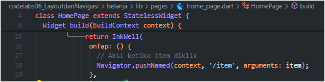

2. Pembacaan nilai yang dikirimkan pada halaman sebelumnya dapat dilakukan menggunakan ModalRoute. Tambahkan kode berikut pada blok fungsi build dalam halaman ItemPage. Setelah nilai didapatkan, anda dapat menggunakannya seperti penggunaan variabel pada umumnya. (https://docs.flutter.dev/cookbook/navigation/navigate-with-arguments)
> final itemArgs = ModalRoute.of(context)!.settings.arguments as Item;

Jawab : 

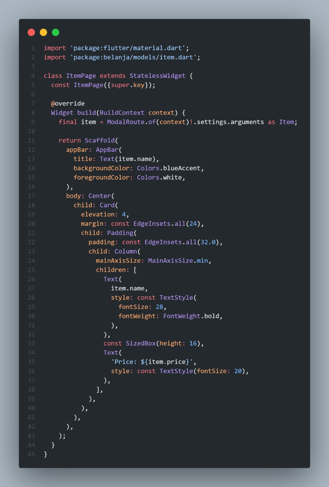

3. Pada hasil akhir dari aplikasi belanja yang telah anda selesaikan, tambahkan atribut foto produk, stok, dan rating. Ubahlah tampilan menjadi GridView seperti di aplikasi marketplace pada umumnya.

Jawab : 

#### Langkah 1: Membuat folder images dan mengunggah foto produk

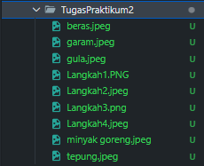

#### Langkah 2: Menambahkan assets di file pubspec.yaml

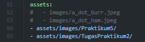

#### Langkah 3: Menambahkan properti baru untuk image, stock, dan rating di item.dart

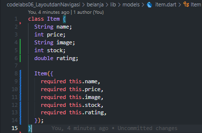

#### Langkah 4: Memperbarui Tampilan home_page.dart menjadi GridView
Merubah ListView.builder menjadi GridView.builder dan menyesuaikan itemBuilder untuk menampilkan data baru dalam format kartu yang sesuai untuk grid.

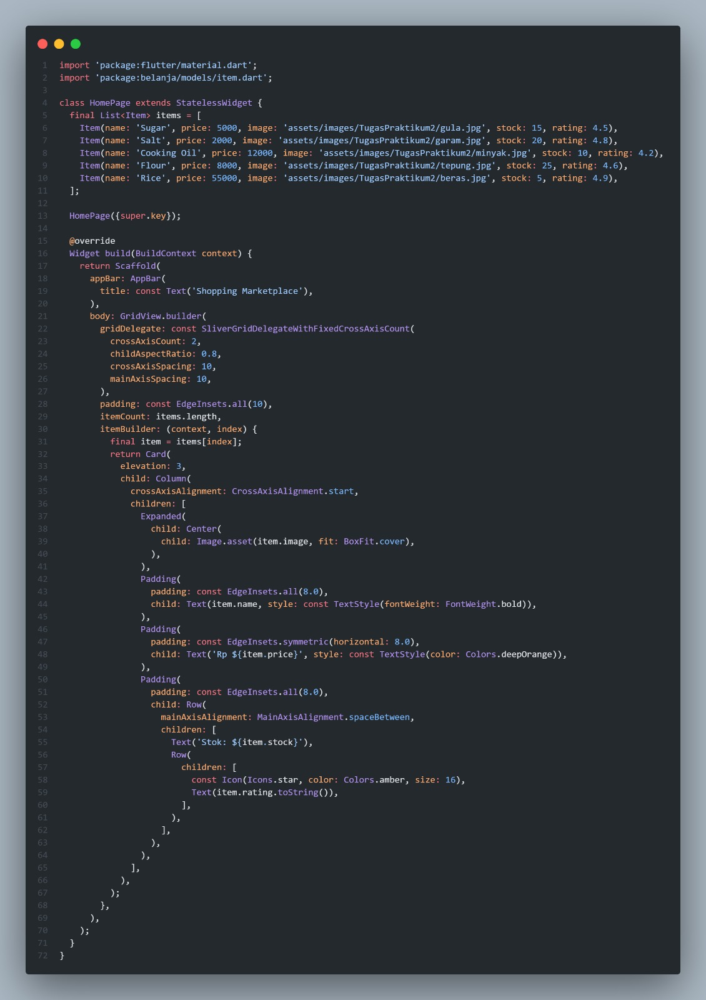

#### Hasil :

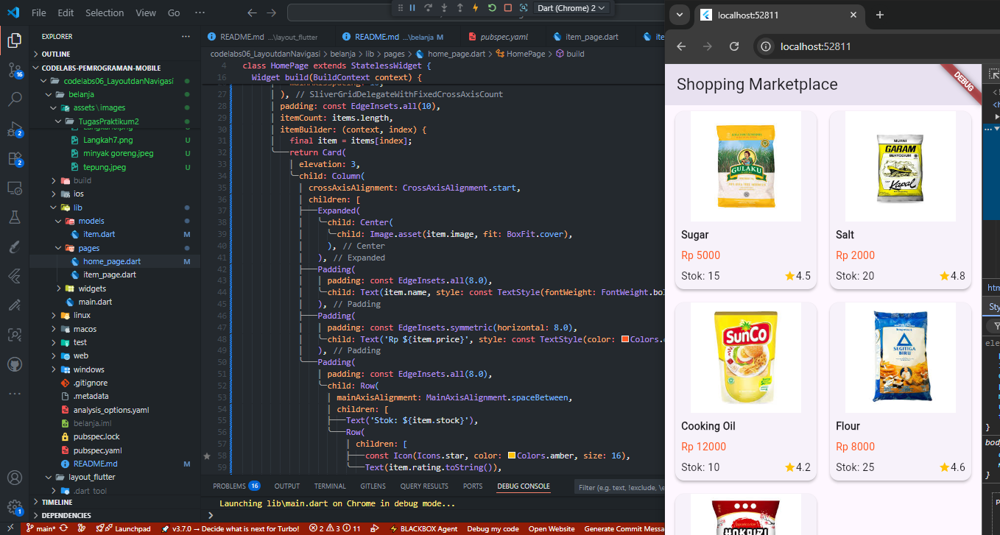

4. Silakan implementasikan Hero widget pada aplikasi belanja Anda dengan mempelajari dari sumber ini: https://docs.flutter.dev/cookbook/navigation/hero-animations

5. Sesuaikan dan modifikasi tampilan sehingga menjadi aplikasi yang menarik. Selain itu, pecah widget menjadi kode yang lebih kecil. Tambahkan Nama dan NIM di footer aplikasi belanja Anda.

Jawab :  Jawaban pertanyaan 4 dan 5 seperti berikut,

#### Langkah 1: Menambahkan atribut deskripsi di model item (item.dart)

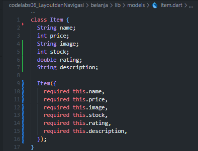

#### Langkah 2: Memberi value ke atribut deskripsi secara statis di home_page.dart

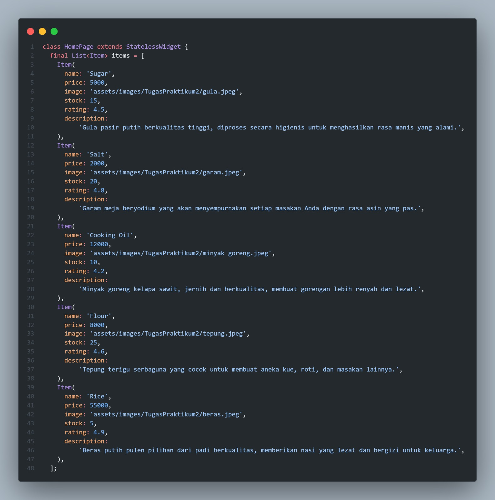

#### Langkah 3: Menerapkan Hero Widget

Membungkus widget Image.asset di HomePage dan ItemPage dengan Hero widget.

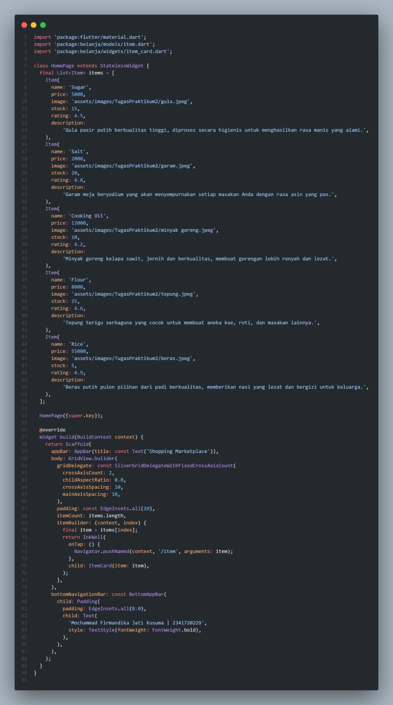

Memastikan tag pada Hero widget sama persis di kedua halaman untuk item yang sama. Tag harus unik untuk setiap item.

#### Langkah 4: Membuat file item_card.dart di folder lib/widgets

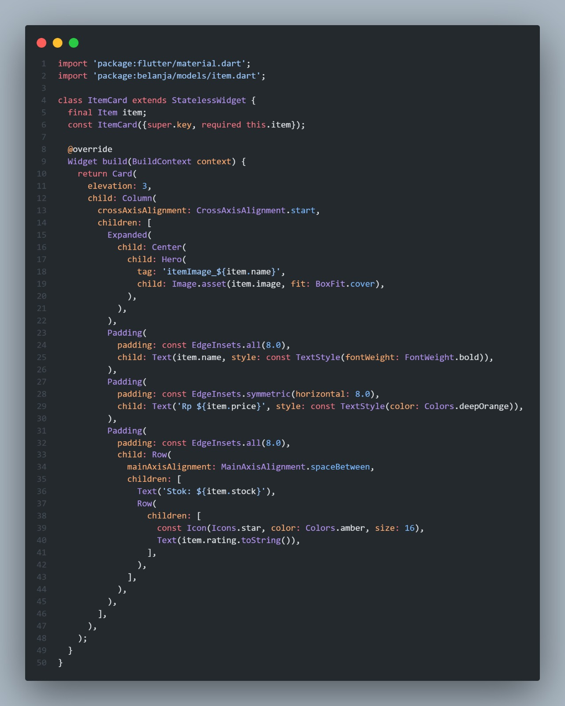

#### Langkah 5: Memperbarui item_page.dart untuk menerima data baru dan menerapkan Hero widget

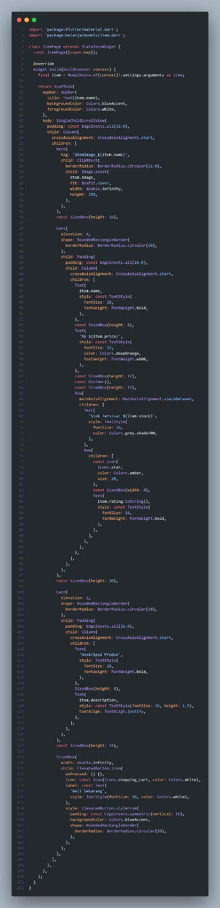

#### Hasil :

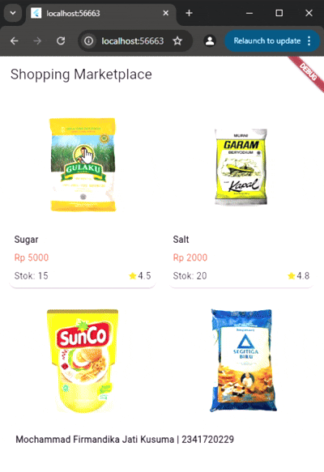

6. Selesaikan Praktikum 5: Navigasi dan Rute tersebut. Cobalah modifikasi menggunakan plugin go_router, lalu dokumentasikan dan push ke repository Anda berupa screenshot setiap hasil pekerjaan beserta penjelasannya di file README.md. Kumpulkan link commit repository GitHub Anda kepada dosen yang telah disepakati!

Jawab :

### Praktikum 5: Membangun Navigasi di Flutter
Selesaikan langkah-langkah praktikum berikut ini menggunakan editor Visual 

#### Langkah 1: Menambahkan Dependency go_router

tambahkan go_router ke dalam file pubspec.yaml, Setelah menambahkan, jalankan perintah flutter pub get di terminal untuk mengunduh paketnya.

#### Langkah 2: Membuat Konfigurasi Router
Buat file baru di dalam folder lib bernama app_router.dart untuk menampung semua konfigurasi rute Anda. Ini akan membuat kode navigasi terpusat dan rapi.

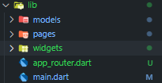

Di dalam file ini, kita akan mendefinisikan semua halaman yang bisa diakses di aplikasi.

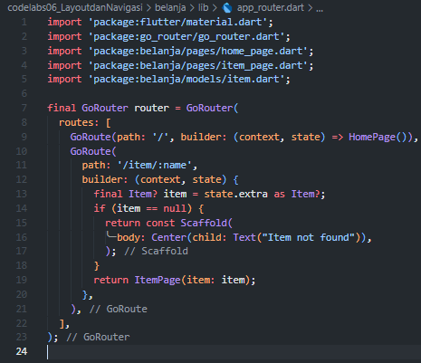

Penjelasan

- GoRoute: Setiap halaman diwakili oleh sebuah GoRoute.

- path: '/item/:name': Ini adalah cara go_router menangani parameter dinamis. :name adalah placeholder untuk nama item yang akan dikirimkan.

- state.extra as Item: Berbeda dari ModalRoute, go_router menggunakan state.extra untuk mengirim dan menerima objek kompleks (seperti kelas Item) antar halaman.

#### Langkah 3: Memperbarui main.dart
Ubah main.dart untuk menggunakan MaterialApp.router dan konfigurasi router yang baru dibuat.

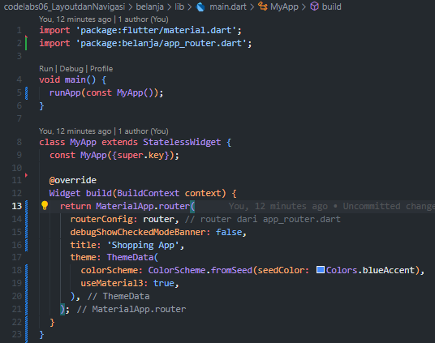

Menggunakan MaterialApp.router dan properti routerConfig untuk memberitahu Flutter agar menyerahkan semua urusan navigasi kepada go_router.

#### Langkah 4: Ubah Cara Navigasi di HomePage
Ganti Navigator.pushNamed dengan context.push().

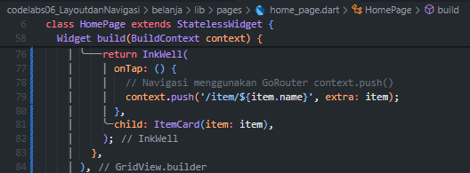

context.push('/item/${item.name}', extra: item):

- /item/${item.name}: Membangun URL dinamis dengan menyisipkan nama item.

- extra: item: Mengirim seluruh objek item melalui parameter extra.

#### Langkah 5: Ubah Cara Menerima Data di ItemPage
Terakhir  ubah ItemPage agar menerima data melalui konstruktornya, bukan lagi dari ModalRoute.

#### Hasil :

