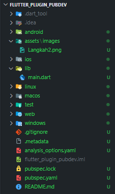
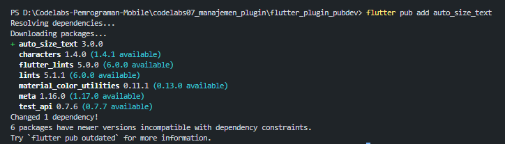
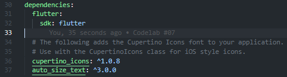
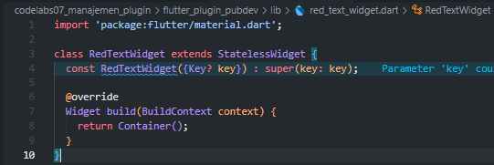
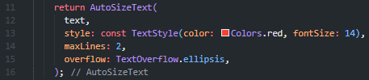
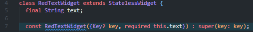
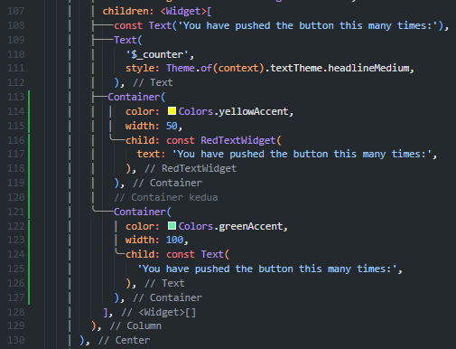
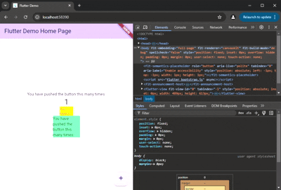

# Laporan Praktikum

# 07 | Manajemen Plugin - Bagian 7

# Pemrograman Mobile

### Nama : Mochammad Firmandika Jati Kusuma

### NIM : 2341720229

### Tugas Praktikum
1. Selesaikan Praktikum tersebut, lalu dokumentasikan dan push ke repository Anda berupa screenshot hasil pekerjaan beserta penjelasannya di file README.md!
    Jawab : 

#### Langkah 1: Buat Project Baru
Buatlah sebuah project flutter baru dengan nama flutter_plugin_pubdev. Lalu jadikan repository di GitHub Anda dengan nama flutter_plugin_pubdev.

#### Langkah 2: Menambahkan Plugin
Tambahkan plugin auto_size_text menggunakan perintah berikut di terminal

Jika berhasil, maka akan tampil nama plugin beserta versinya di file pubspec.yaml pada bagian dependencies.

#### Langkah 3: Buat file red_text_widget.dart
Buat file baru bernama red_text_widget.dart di dalam folder lib lalu isi kode seperti berikut.

#### Langkah 4: Tambah Widget AutoSizeText
Masih di file red_text_widget.dart, untuk menggunakan plugin auto_size_text, ubahlah kode return Container() menjadi seperti berikut.

Setelah Anda menambahkan kode di atas, Anda akan mendapatkan info error. Mengapa demikian? Jelaskan dalam laporan praktikum Anda!
    Jawab : Kode tersebut menghasilkan error karena widget AutoSizeText membutuhkan variabel text untuk menampilkan konten, tetapi variabel itu belum didefinisikan dalam kelas RedTextWidget. Gampangnya, kode itu mencoba menyuruh widget untuk menampilkan sesuatu, tetapi tidak memberikan teks apa pun. Untuk memperbaikinya, perlu ditambahkan variabel text ke dalam kelas RedTextWidget dan mengubah konstruktornya agar bisa menerima teks sebagai input. Dengan begitu, kode akan tahu teks apa yang harus ditampilkan dan error pun akan hilang.

#### Langkah 5: Buat Variabel text dan parameter di constructor
Tambahkan variabel text dan parameter di constructor seperti berikut.

#### Langkah 6: Tambahkan widget di main.dart
Buka file main.dart lalu tambahkan di dalam children: pada class _MyHomePageState

Run aplikasi tersebut dengan tekan F5, maka hasilnya akan seperti berikut

Hasil :

2. Jelaskan maksud dari langkah 2 pada praktikum tersebut!
    
    Jawab : Maksud dari langkah 2 ini untuk menambahkan plugin eksternal ke dalam proyek Flutter. Perintah flutter pub add auto_size_text digunakan untuk mengunduh dan menginstal paket dari pub.dev, sehingga proyek bisa menggunakan widget AutoSizeText yang dapat menyesuaikan ukuran teks secara otomatis. Setelah perintah ini berhasil, nama plugin dan versinya akan tercatat di file pubspec.yaml.

3. Jelaskan maksud dari langkah 5 pada praktikum tersebut!
   
   Jawab : Maksud dari langkah 5 ini agar RedTextWidget bisa menerima data dari luar. Awalnya, widget ini kosong. Dengan menambahkan final String text; dan required this.text pada konstruktornya, kita membuat properti text yang wajib diisi saat widget dipanggil. Ini mengubahnya menjadi widget yang dapat digunakan kembali (reusable) untuk menampilkan berbagai teks yang berbeda.

4. Pada langkah 6 terdapat dua widget yang ditambahkan, jelaskan fungsi dan perbedaannya!
   
   Jawab : Pada langkah 6 terdapat dua widget yang ditambahkan memiliki fungsi berbeda. Widget pertama memakai RedTextWidget yang menggunakan plugin AutoSizeText. Ini membuat teks di dalamnya dapat mengecil secara otomatis agar muat di dalam kotak kuning.

Sebaliknya, Widget kedua memakai widget Text biasa. Widget ini tidak memiliki kemampuan tersebut, sehingga teks di dalam kotak hijau akan terpotong jika terlalu panjang.

Intinya, perbedaannya adalah cara keduanya menangani teks yang tidak muat. Satu widget cerdas dan menyesuaikan diri, sementara yang lain hanya memotong teks.

5. Jelaskan maksud dari tiap parameter yang ada di dalam plugin auto_size_text berdasarkan tautan pada dokumentasi ini !
    
    Jawab : 
### Parameter Utama & Gaya
- text (parameter pertama)
Berisi teks utama yang ingin ditampilkan. Contoh:
AutoSizeText('Ini teks saya').

- style
Menggunakan TextStyle untuk mengatur tampilan teks seperti warna, ketebalan, dan jenis font.
Nilai fontSize di sini menjadi ukuran awal sebelum plugin menyesuaikannya agar muat di layar.

- maxLines
Menentukan jumlah maksimum baris yang dapat digunakan oleh teks.
Jika tidak diatur, teks otomatis menyesuaikan tinggi dan lebar area yang tersedia.

#

### Parameter Pengatur Ukuran
- minFontSize
Menentukan ukuran font terkecil yang masih diizinkan.
Jika teks tetap tidak muat setelah mencapai batas ini, maka aturan overflow akan diterapkan.
(Default: 12)

- maxFontSize
Menentukan ukuran font terbesar yang boleh digunakan.
Cocok untuk membatasi teks agar tidak terlalu besar pada area yang luas.

- stepGranularity
Mengatur seberapa besar pengurangan ukuran font setiap kali plugin menyesuaikan ukuran.
Nilai default adalah 1, dan disarankan tidak lebih kecil agar performa tetap optimal.

- presetFontSizes
Menyediakan daftar ukuran font tertentu yang boleh digunakan.
Jika parameter ini diatur, maka minFontSize, maxFontSize, dan stepGranularity akan diabaikan.
Daftar ukuran harus diurutkan dari besar ke kecil, misalnya [40, 20, 14].

#
### Parameter Penanganan Overflow

- overflow
Menentukan cara menampilkan teks yang masih tidak muat setelah penyesuaian ukuran.
Contohnya: TextOverflow.ellipsis untuk menambahkan tanda "..." di akhir teks.

- overflowReplacement
Menentukan widget pengganti jika teks tetap tidak muat.
Cocok untuk menampilkan ikon, pesan, atau elemen lain agar teks tidak menjadi terlalu kecil dan sulit dibaca.

#
### Parameter Lanjutan & Tambahan
- group
Digunakan untuk menyamakan ukuran teks di beberapa AutoSizeText.
Semua widget dalam satu grup akan memiliki ukuran font yang sama, mengikuti teks dengan ukuran terkecil.

- wrapWords
Menentukan apakah kata panjang boleh dipisah ke baris berikutnya.
Secara default bernilai true, agar berperilaku seperti Text biasa.

- Parameter lainnya
Parameter seperti key, textAlign, textDirection, locale, softWrap, textScaleFactor, dan semanticsLabel
berfungsi sama seperti di widget Text bawaan Flutter.

#

| Parameter             | Penjelasan Singkat                                   |
| --------------------- | ---------------------------------------------------- |
| `key`                 | Identitas unik widget.                               |
| `textKey`             | Kunci untuk teks internal.                           |
| `style`               | Gaya teks (warna, font, ukuran awal).                |
| `minFontSize`         | Ukuran teks terkecil agar tetap muat.                |
| `maxFontSize`         | Ukuran teks terbesar yang diizinkan.                 |
| `stepGranularity`     | Langkah penurunan ukuran font saat mengecilkan teks. |
| `presetFontSizes`     | Daftar ukuran font yang boleh digunakan.             |
| `group`               | Menyamakan ukuran teks di beberapa widget.           |
| `textAlign`           | Posisi teks (kiri, tengah, kanan).                   |
| `textDirection`       | Arah teks (LTR atau RTL).                            |
| `locale`              | Pengaturan bahasa/font lokal.                        |
| `softWrap`            | Izinkan teks turun ke baris berikutnya.              |
| `wrapWords`           | Potong kata panjang agar muat.                       |
| `overflow`            | Cara menangani teks yang kelebihan.                  |
| `overflowReplacement` | Widget pengganti saat teks tidak muat.               |
| `textScaleFactor`     | Skala teks sesuai preferensi pengguna.               |
| `maxLines`            | Jumlah baris maksimal teks.                          |
| `semanticsLabel`      | Label untuk pembaca layar (aksesibilitas).           |
                    

#

        import 'package:flutter/material.dart';
        import 'package:auto_size_text/auto_size_text.dart';

        class AutoSizeExample extends StatelessWidget {
        const AutoSizeExample({super.key});

        @override
        Widget build(BuildContext context) {
            return Scaffold(
                appBar: AppBar(title: const Text('Contoh AutoSizeText')),
                    body: Center(
                        child: AutoSizeText(
                        'Teks ini akan otomatis menyesuaikan ukuran agar tetap muat dalam kotak.',
                        style: const TextStyle(fontSize: 40, color: Colors.blue),
                        minFontSize: 12, // ukuran terkecil
                        maxFontSize: 40, // ukuran terbesar
                        stepGranularity: 1, // penurunan ukuran per 1 point
                        maxLines: 2, // maksimal 2 baris
                        overflow: TextOverflow.ellipsis, // tambahkan "..." jika kelebihan
                        textAlign: TextAlign.center, // posisi teks di tengah
                        textScaleFactor: 1.0, // skala teks normal
                        softWrap: true, // izinkan teks turun baris
                        wrapWords: true, // potong kata panjang jika perlu
                        semanticsLabel: 'Contoh teks yang bisa menyesuaikan ukuran', // untuk aksesibilitas
                        ),
                    ),
                );
            }
        }

6. Kumpulkan laporan praktikum Anda berupa link repository GitHub kepada dosen!
   
   Jawab : https://github.com/FirmanJK/Codelabs-Pemrograman-Mobile/tree/main/codelabs07_manajemen_plugin/flutter_plugin_pubdev

