# Laporan Praktikum

# 09 | Kamera

# Pemrograman Mobile

### Nama : Mochammad Firmandika Jati Kusuma

### NIM : 2341720229

## Tugas Praktikum 

1. Selesaikan Praktikum 1 dan 2, lalu dokumentasikan dan push ke repository Anda berupa screenshot setiap hasil pekerjaan beserta penjelasannya di file README.md! Jika terdapat error atau kode yang tidak dapat berjalan, silakan Anda perbaiki sesuai tujuan aplikasi dibuat!
    
    Jawab :

### Praktikum 1: Mengambil Foto dengan Kamera di Flutter

#### Langkah 1: Buat Project Baru
Buatlah sebuah project flutter baru dengan nama kamera_flutter, lalu sesuaikan style laporan praktikum yang Anda buat.

#### Langkah 2: Tambah dependensi yang diperlukan
- camera → menyediakan seperangkat alat untuk bekerja dengan kamera pada device.

- path_provider → menyediakan lokasi atau path untuk menyimpan hasil foto.

- path → membuat path untuk mendukung berbagai platform.

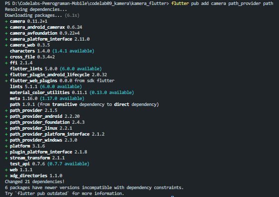

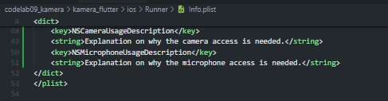

#### Langkah 3: Ambil Sensor Kamera dari device
Selanjutnya, kita perlu mengecek jumlah kamera yang tersedia pada perangkat menggunakan plugin camera seperti pada kode berikut ini. Kode ini letakkan dalam void main().

Ubah void main() menjadi async function seperti berikut ini.

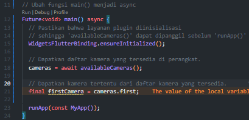

#### Langkah 4: Buat dan inisialisasi CameraController
Setelah Anda dapat mengakses kamera, gunakan langkah-langkah berikut untuk membuat dan menginisialisasi CameraController. Pada langkah berikut ini, Anda akan membuat koneksi ke kamera perangkat yang memungkinkan Anda untuk mengontrol kamera dan menampilkan pratinjau umpan kamera.

1. Buat StatefulWidget dengan kelas State pendamping.
2. Tambahkan variabel ke kelas State untuk menyimpan CameraController.
3. Tambahkan variabel ke kelas State untuk menyimpan Future yang dikembalikan dari CameraController.initialize().
4. Buat dan inisialisasi controller dalam metode initState().
5. Hapus controller dalam metode dispose().

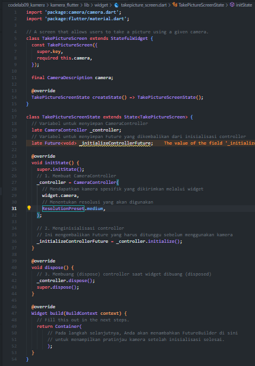

#### Langkah 5: Gunakan CameraPreview untuk menampilkan preview foto
Gunakan widget CameraPreview dari package camera untuk menampilkan preview foto. Anda perlu tipe objek void berupa FutureBuilder untuk menangani proses async.

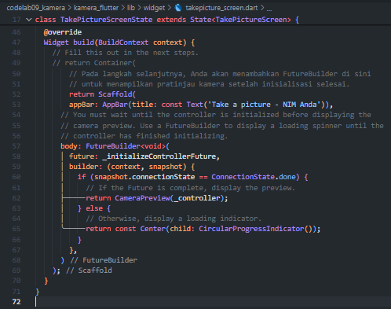

#### Langkah 6: Ambil foto dengan CameraController
Anda dapat menggunakan CameraController untuk mengambil gambar menggunakan metode takePicture(), yang mengembalikan objek XFile, merupakan sebuah objek abstraksi File lintas platform yang disederhanakan. Pada Android dan iOS, gambar baru disimpan dalam direktori cache masing-masing, dan path ke lokasi tersebut dikembalikan dalam XFile.

Pada codelab ini, buatlah sebuah FloatingActionButton yang digunakan untuk mengambil gambar menggunakan CameraController saat pengguna mengetuk tombol.

Pengambilan gambar memerlukan 2 langkah:

Pastikan kamera telah diinisialisasi.
Gunakan controller untuk mengambil gambar dan pastikan ia mengembalikan objek Future.
Praktik baik untuk membungkus operasi kode ini dalam blok try / catch guna menangani berbagai kesalahan yang mungkin terjadi.

Kode berikut letakkan dalam Widget build setelah field body.

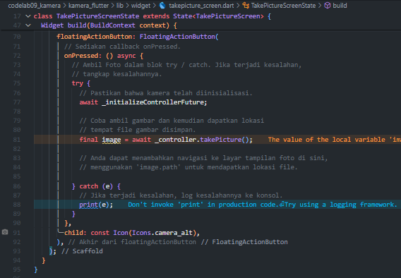

#### Langkah 7: Buat widget baru DisplayPictureScreen
Buatlah file baru pada folder widget yang berisi kode berikut.

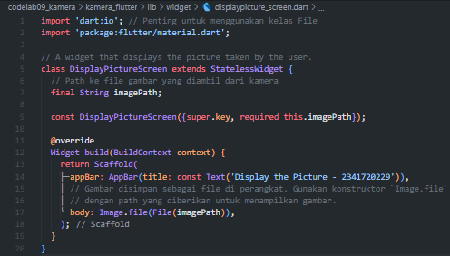

#### Langkah 8: Edit main.dart
Edit pada file ini bagian runApp seperti kode berikut.

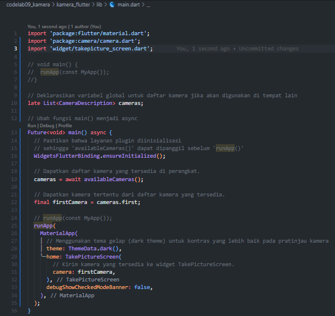

#### Langkah 9: Menampilkan hasil foto
Tambahkan kode seperti berikut pada bagian try / catch agar dapat menampilkan hasil foto pada DisplayPictureScreen.

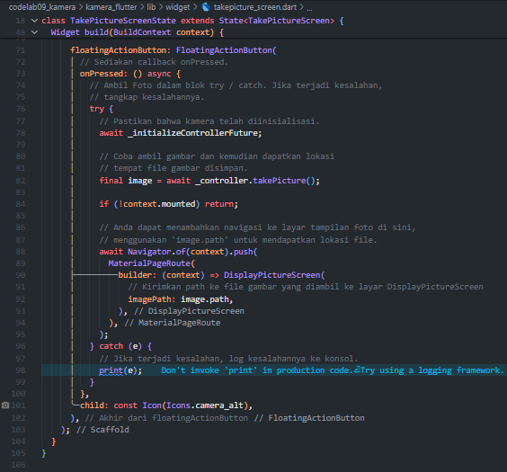

Silakan deploy pada device atau smartphone Anda dan perhatikan hasilnya!

### Praktikum 2: Membuat photo filter carousel

#### Langkah 1: Buat project baru
Buatlah project flutter baru di pertemuan 09 dengan nama photo_filter_carousel

#### Langkah 2: Buat widget Selector ring dan dark gradient
Buatlah folder widget dan file baru yang berisi kode berikut.

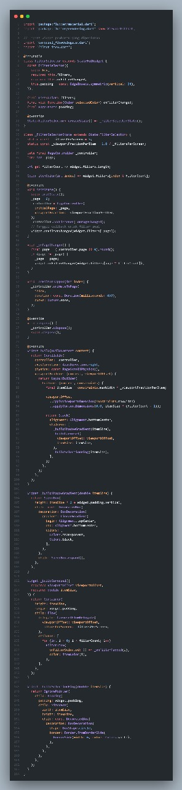

#### Langkah 3: Buat widget photo filter carousel
Buat file baru di folder widget dengan kode seperti berikut.

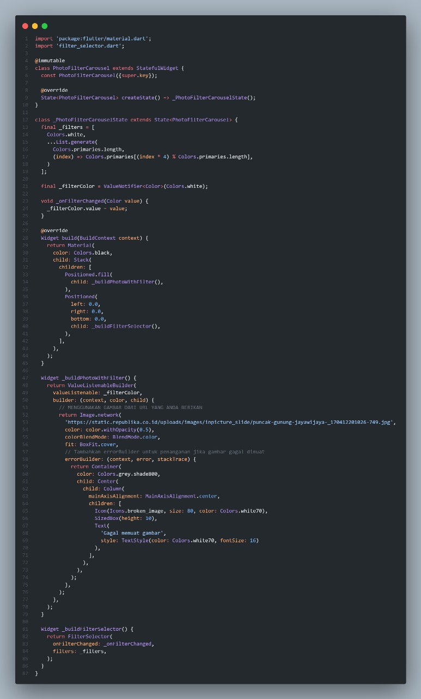

#### Langkah 4: Membuat filter warna - bagian 1
Buat file baru di folder widget seperti kode berikut.

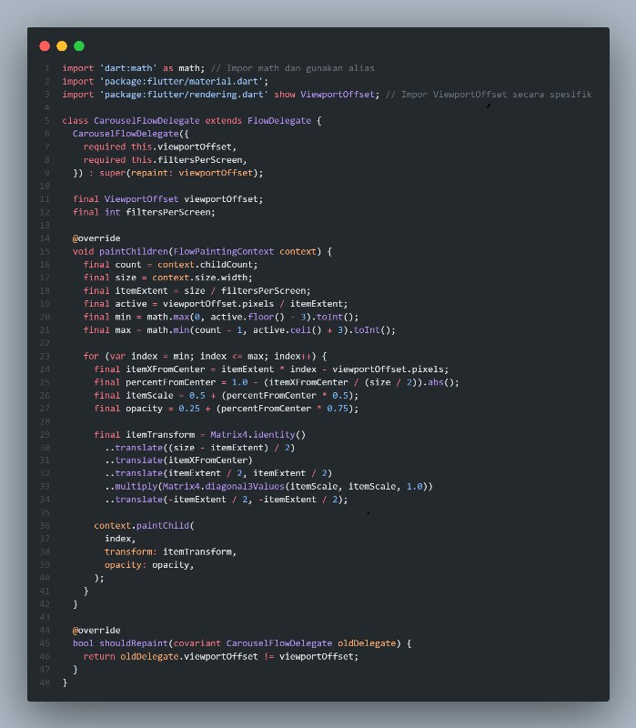

#### Langkah 5: Membuat filter warna
Buat file baru di folder widget seperti kode berikut ini.

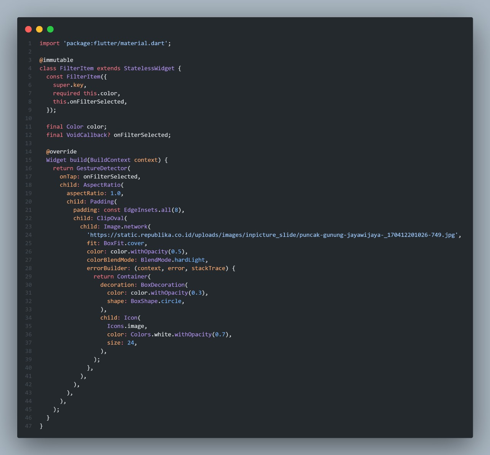

#### Langkah 6: Implementasi filter carousel
Terakhir, kita impor widget PhotoFilterCarousel ke main seperti kode berikut ini.

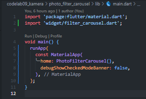

#### Troubleshoot
Jika diperlukan, beberapa widget yang telah Anda buat sebelumnya, memerlukan kode import berikut ini.

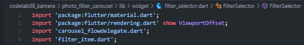

#### Output

2. Gabungkan hasil praktikum 1 dengan hasil praktikum 2 sehingga setelah melakukan pengambilan foto, dapat dibuat filter carouselnya!

    Jawab :

#### Langkah 1: Buat project baru
Buatlah project flutter baru di pertemuan 09 dengan nama camera_filter_app

#### Langkah 2 : Buat Widget Camera Screen atau Take Picture, Display Picture Screen

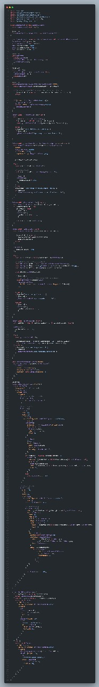

#### Langkah 3: Buat widget Selector ring dan dark gradient
Buatlah folder widget dan file baru yang berisi kode berikut.

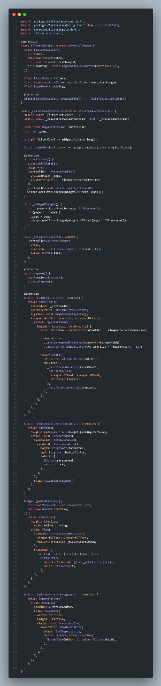

#### Langkah 4: Buat widget photo filter carousel atau photo filter screen
Buat file baru di folder widget dengan kode seperti berikut.

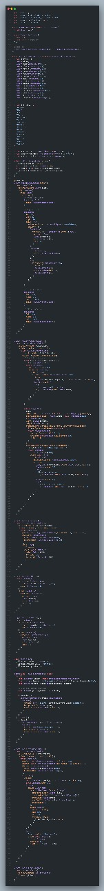

#### Langkah 5: Membuat filter warna - bagian 1
Buat file baru di folder widget seperti kode berikut.

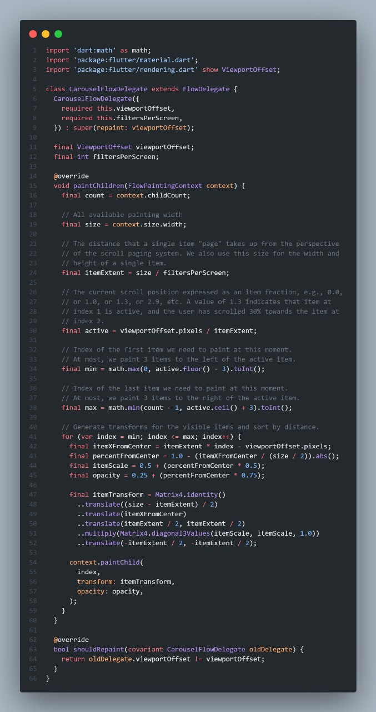

#### Langkah 6: Membuat filter warna
Buat file baru di folder widget seperti kode berikut ini.

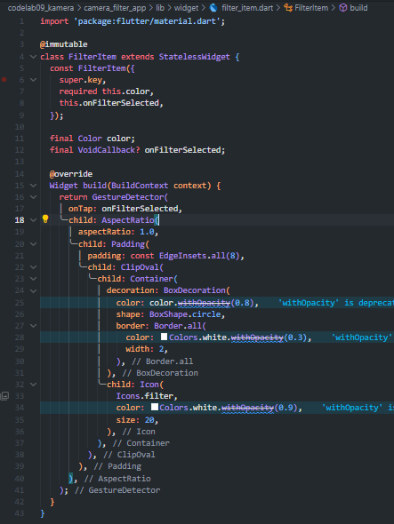

#### Langkah 7: Menampilkan hasil foto dan Implementasi filter carousel

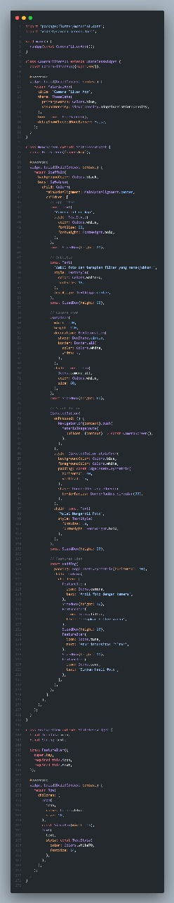

#### Output

3. Jelaskan maksud void async pada praktikum 1?

    Jawab : Pada praktikum 1, fungsi main() diubah menjadi Future<void> main() async karena di dalamnya terdapat pemanggilan fungsi yang bersifat asinkron (membutuhkan waktu tunggu) seperti availableCameras() yang menggunakan kata kunci await. Kata kunci async menandakan bahwa fungsi tersebut akan berjalan secara asinkron (tidak harus selesai seketika) dan dapat "menjeda" eksekusi dengan await. Sementara itu, void atau Future<void> menunjukkan bahwa fungsi tersebut tidak mengembalikan nilai spesifik setelah selesai. Dalam konteks Flutter, ini memastikan bahwa proses inisialisasi plugin seperti kamera telah selesai sebelum aplikasi (runApp()) diluncurkan, mencegah aplikasi crash karena mencoba mengakses resource yang belum siap.

4. Jelaskan fungsi dari anotasi @immutable dan @override ?

    Jawab : Anotasi @immutable adalah petunjuk bagi compiler Dart (dan tool pengembangan) bahwa kelas tersebut, dan semua fieldnya, seharusnya tidak diubah (imutable) setelah objek dibuat (diinisialisasi). Anotasi ini sering digunakan pada widget StatelessWidget dan StatefulWidget di Flutter untuk memastikan bahwa data yang dilewatkan ke widget tersebut bersifat final, yang membantu dalam optimalisasi kinerja dan mencegah bug terkait perubahan status yang tidak terduga. Anotasi @override, di sisi lain, berfungsi untuk menyatakan bahwa sebuah metode dalam subclass (kelas anak) sengaja menggantikan atau menimpa metode dengan nama yang sama yang ada di superclass (kelas induk). Anotasi ini wajib digunakan ketika menimpa metode dasar dari kelas Flutter seperti build(), initState(), atau dispose(), dan berfungsi sebagai pengaman compiler untuk memverifikasi bahwa penimpaan tersebut sudah benar dan sesuai dengan tanda tangan metode aslinya.

5. Kumpulkan link commit repository GitHub Anda kepada dosen yang telah disepakati!
    
    Jawab : https://github.com/FirmanJK/Codelabs-Pemrograman-Mobile/tree/main/codelab09_kamera 